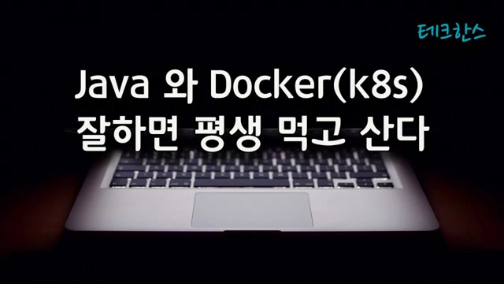
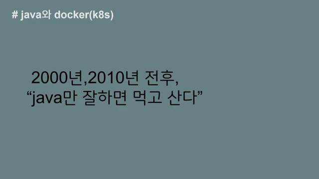
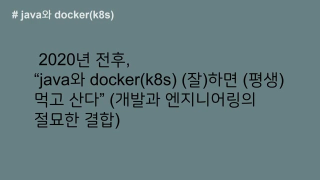
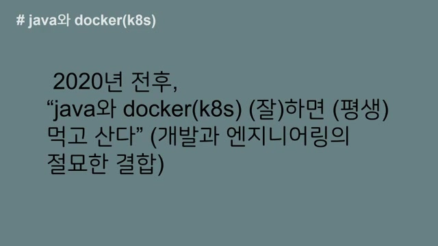
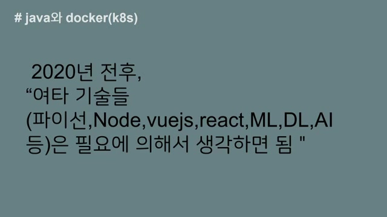
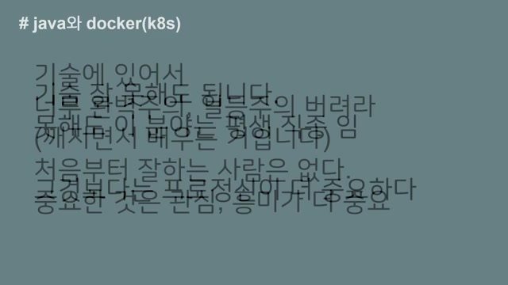
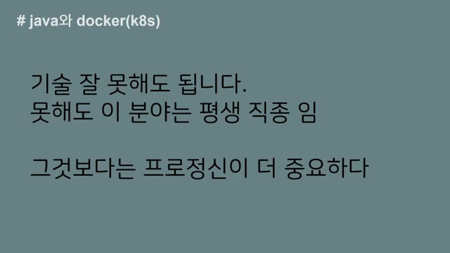
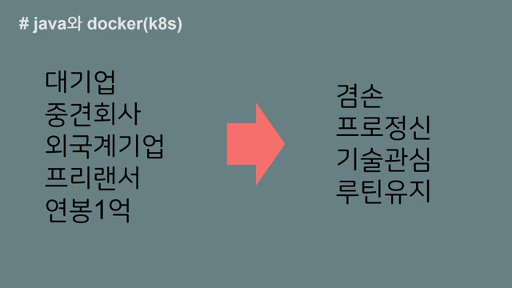
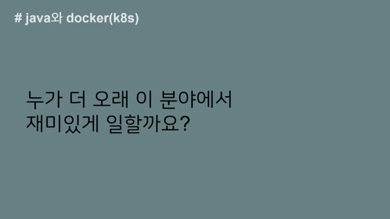

# Java 와 Docker(k8s) 잘하면 평생 먹고 산다

흥미로운 내용 3가지 :

- 자바는 10년 이상 안정적인 직업을 보장해줄 수 있음
- 자바와 도커에 집중하여 기술 전념함
- 기술 기반으로 안정적으로 먹고 살 수 있음

영상은 자바와 도커의 중요성을 강조하며, 이를 잘 활용하면 평생 안정적으로 일할 수 있다는 주제를 담고 있습니다. 과거와 현재를 통해 느낀 경험을 공유하며, IT 업종에서의 지속 가능성과 커리어에 대한 긍정적인 마인드를 전합니다. 자바와 도커의 조합이 앞으로도 많은 기회를 제공할 것이라는 확신을 가진 만큼, 초심자에게도 자신감을 심어주는 내용입니다.

## 핵심주제

**자바**와 **Docker**는 기술 기반으로 평생 먹고 살 수 있는 안정적인 직업을 보장한다.

- **자바**는 10년 이상의 안정적인 직업을 제공하며, 현재까지도 많은 개발자들이 이 기술로 생계를 이어가고 있다.
    
- 특히, **도커**와 같은 지속 가능한 기술들은 IT 업종에서 높은 **가성비**를 제공하며, 계약 시에도 안정적인 조건이 유지된다.
    
- 이러한 기술은 깊이 있고, 다양한 직업 기회를 제공하므로 지속적으로 발전할 수 있는 가능성이 크다.
    

기술 선택에서 **자바**와 **도커**는 가성비가 뛰어난 선택으로 판단된다.

- 한국 시장에서 **자바**와 **스프링**의 조합은 안정적으로 인증된 플랫폼으로, 향후 10~20년 동안 유지될 가능성이 크다.
    
- 초심자들이 다양한 기술을 시도하는 것 또한 중요하지만, **업무 도메인**과 **DB 모델링**에 대한 고민이 필수적이다.
    
- 기술에 대한 흥미와 관심을 지속적으로 유지하는 것이 중요하며, 이는 개인의 성장과 커리어 발전에 기여할 것이다.
    

IT 업종에서의 경력 발전은 **기술의 깊이**를 중요시해야 한다.

- 무분별하게 여러 기술을 사용하는 것보다는 특정 기술에 대해 깊이 있게 이해하는 것이 경력 발전에 더 큰 도움이 된다.
    
- 주변의 도움을 받아 지속적으로 공부하고 익숙해지는 과정이 중요하며, 초조해하지 말고 마라톤처럼 긴 호흡으로 바라봐야 한다.
    
- 결국, 생업이 중요하다면 다양한 업종에 기웃거릴 필요가 없으며, 전문 기술력을 통해 롱런할 수 있는 가능성이 준비되어 있다.
    

**인간관계**와 **겸손**은 직업 선택에서 매우 중요한 요소이다.

- 직업 변경 이유 중 많은 부분이 대면 관계의 어려움에서 비롯되며, 이는 개인의 성향과 맞지 않으면 업무에 영향을 미칠 수 있다.
    
- 겸손한 태도로 맡은 바를 성실히 수행하는 것이 중요하며, 기술자와 일반 직원의 커리어가 다름을 이해해야 한다.
    
- 기술적 직업을 가지면 더 오래 재미있게 일을 할 수 있으며, 그 재미를 포기하는 것은 부정적인 태도라고 할 수 있다.
    

## 타임라인

### 1. 🚀 자바와 Docker의 중요성

- **자바**는 단기적으로 10년 이상 **안정적인 직업**을 보장할 수 있다.
    
- 과거에는 **공무원 시험**이나 **자영업** 등 다양한 길이 있었으나, 다른 업종에 관심을 두지 않았다.
    
- **자바**와 **Docker**에만 집중하기에도 시간이 많이 소요되므로, 해당 기술에만 전념하였다.
    
- **자바**만 잘해도 **평생 먹고 살 수 있다는 긍정적인 마인드**로 생활하였다.
    
- **2000년 전후**와 **2010년 전후**에도 해당 기술에 대한 확신이 있었음.
    

### 2. 2024년 현재, 자바로 살아가며 커리어에 만족함.

- 현재 2024년에도 저는 **자바**로 생계를 이어가고 있습니다.
    
- 잘못된 보직을 받았다고 생각할 수 있는 공무원 생활 속에서도 나름대로 제 커리어에 만족하고 있습니다.
    
- 제 이력서를 업데이트할 때마다 솔직히 만족감을 느끼며, 돈과 관계없이 계속 일을 하고 싶은 마음이 예전보다 더 강해진 것 같습니다.
    
- 이러한 경험을 바탕으로 시작하는 분들 또는 경력이 10년 정도 되는 분들도 자신의 방향성에 대해 고민해보길 바랍니다.
    
- 저는 다른 분야에도 기웃거렸지만, 결과적으로 나를 **인정**하고 도움을 줄 수 있는 곳은 IT 업종이란 생각이 듭니다.
    

  

### 3. IT 업종에서의 경력과 지속 가능한 기술에 대한 이야기

- 나이가 많다고 해서 IT 업종에서 급여가 깎이지 않으며, 계약 시 동일한 조건으로 유지된다.
    
- 2020년 전후로 도커와 같은 지속 가능한 기술이 많이 논의되기 시작했고, 이는 과거 디자인 분야에서도 중요한 이슈였다.
    
- 특히, 자바와 스프링, 도커, 쿠버네티스(K8s)와 같은 기술이 현재 제가 제시할 수 있는 영역이다.
    
- 계약할 때 금액에 크게 신경 쓰지 않게 되었으며, 아는 사람은 이러한 사실을 잘 이해한다.
    

  

### 4. 기술 기반으로 평생 먹고 살 수 있다.

- 압박감을 느낄 필요 없이, 하면 평생 먹고 살 수 있다고 자신할 수 있다.
    
- 현재와 과거의 기분을 비교할 때, 2030년과 2040년에도 비슷한 상황이 지속될 것으로 기대한다.
    
- 기술의 깊이와 리드하는 그룹의 움직임은 스프링 쪽에서 보이는데, 도커와 쿠버네티스의 기술 스택은 상당히 깊이가 있다.
    
- 이런 기술을 자유롭게 다룰 수 있다면, 기술 기반으로 안정적으로 먹고 살 수 있을 것이며, 다른 업종에 영향을 주거나 관심을 쏟을 필요는 없을 것 같다.
    
- 결국, 지속적으로 10년, 20년, 30년 동안 기술에 머물러 있다면 평생 먹고 살 만하다는 확신이 든다.
    

  

### 5. 자바 개발자 경험을 통한 새로운 기술 접근법

- 저는 자바 개발자로 시작했지만, 그 당시의 엔지니어링은 **단순한 컨피규레이션** 수준에 불과했고, 여러 기술들이 엇갈려 있었던 경험이 있다.
    
- 비록 과거 기술들이 많이 사라졌지만, 도커와 쿠버네티스는 이식성과 독립성 측면에서 **독특한 기술**이라고 생각된다.
    
- 프론트 단의 기술 개발 변화가 많은 요즘, 자바와 도커는 최소 10년 또는 20년까지도 **지속 가능성**을 가질 것으로 보인다.
    
- 그러나 개발과 엔지니어링을 지나치게 분리하다 보면 균형이 깨질 수 있으며, 이 두 분야의 조합이 매우 중요하다고 생각한다.
    
- 결국 자바, 도커, 쿠버네티스 같은 기술들은 도전해 볼 만한 가치가 있으며, 현재 많은 사람들이 이 분야에 투자하고 있다.
    

  

### 6. 제 인생을 걸고, AI 기술 및 머신러닝 추천에 대한 생각

- 제 인생을 **올인**할 만하다는 확신이 들어서 이러한 영상을 올리고 있다.
    
- 2020년 전후로 다양한 기술이 존재하며, 현재 **파이썬**, **노드**, **뷰 JS**, **리액트**, **머신러닝**, **딥러닝**, **AI** 등의 분야가 많이 있다.
    
- 현재의 AI 기술은 하드한 코어 부분에 접근하지 않으며, 우리는 필요한 API를 사용하면 된다.
    
- 머신러닝, 딥러닝, AI 쪽은 중요하지만, **통계적 지식**과 **수학적 지식**이 필요하며, 기초가 약하면 보답이 늦을 수 있다.
    
- 따라서 기술적 장벽이 낮은 분야를 고려하면, 지금 당장은 머신러닝이나 AI 쪽에 대한 추천을 강력히 하지 않는다.
    

  

### 7. 프로그램 언어와 기술 선택의 중요성

- 파이썬, 노드, 뷰, 리액트와 같은 기술들은 좋지만, 한국 시장은 상대적으로 작아서 자바와 도커 조합이 현재 가장 **가성비 좋은** 선택이라고 생각한다.
    
- 초심자는 여러 기술을 시도해보는 것이 좋지만, **업무 도메인**과 DB 모델링을 고민하며 너무 많은 기술을 알 필요는 없다.
    
- 한국에서는 자바와 스프링이 안정적으로 인증된 플랫폼이므로, 자바와 도커, 쿠버네티스 조합이 향후 10~20년간 강력하게 유지될 것이다.
    
- 기술을 배울 때 완벽함이나 1등주의를 버리고, 지속적으로 **관심**과 **흥미**를 유지해야 한다.
    
- 이 동영상은 여러분이 지치지 않고 계속해서 성장할 수 있도록 돕는 것이 목적이다.
    

  

### 8. 기술의 깊이를 중요시하는 경력 발전 방법

- **기술** 4대 주의지만, **가성비** 측면에서 자바, 도커, 쿠버네티스 같은 기술에 집중해도 괜찮다.
    
- 주변의 도움을 받으며 지속적으로 공부하다 보면 자연스럽게 익숙해지고 잘하게 된다.
    
- 이 분야는 **평생 직종**이므로 서두를 필요가 없으며, 마라톤처럼 길게 바라보아야 한다.
    
- 무분별하게 여러 기술을 사용하기보다는 특정 기술에 대해 깊이 있게 이해하는 것이 더 중요하다.
    

  

### 9. ️💻IT 업종에서 프로 정신과 커리어 유지의 중요성.

- 자바 스프링, 도커, 쿠버네티스 같은 기술에 집중하는 **티자형 기술 접근**이 중요하다.
    
- 대기업, 중견회사, 외국계 기업 그리고 프리랜서 경험을 통해 연봉 1억을 찍었지만, 현재는 감사하게도 여전히 이 업종에서 일할 수 있다.
    
- 10년, 20년 차가 되면 후배에게 자리를 물려주고 다른 일을 생각할 수도 있지만, 생업이 중요하다면 다른 업종에 기웃거리는 건 의미가 없다.
    
- 기술이 부담이 된다면 프로젝트 관리자로 전환할 수 있지만, 이는 결국 다른 IT 업종에서 **롱런**할 수 있는 커리어 라인이며, 관리자로서의 스트레스도 기술 업종과 다르지 않다.
    

### 10. 직업 선택에서의 인간관계와 겸손의 중요성

- 직업을 변경하는 이유는 종종 대면 관계가 **어렵기 때문**이며, 이는 자신의 성향과 맞지 않으면 출근이 괴로울 수 있다.
    
- 저는 현재 자신의 커리어에 **만족**하고 있으며, 겸손한 태도로 맡은 바를 성실히 수행해야 한다고 생각한다.
    
- 또한, 과거 경험을 통해 기술자와 일반직장의 커리어가 다르므로 비교를 통해 좌절하지 말아야 한다.
    
- 즉, 기술을 다루는 사람이 더 오래 재미있게 일을 할 수 있으며, 그 재미를 포기하는 것은 겸손하지 못한 태도라고 할 수 있다.
    

### 11. ️🏢재미있는 기술과 만족감을 찾는 여정

- 지켜야 할 곳은 **재미있는 기술**을 유지해주는 조직이다.
    
- 정규직이든 비정규직이든 간판은 중요한 요소이며, 외국계 대기업에서 일했지만, 지금이 더 **만족스럽다**.
    
- 현재의 만족감은 **겸손함**을 알게 되었기 때문이며, 취업이 안 되어도 인내하면 보답이 온다.
    
- 보답이 언제 올지는 모르지만, 결국은 반드시 찾아온다.
    
