# AIKU 24-2 DeepIntoDeep 10회 딥러닝 입문하기 - Segmentation

흥미로운 내용 3가지 :

- 세그멘테이션은 이미지에서 객체가 차지하는 영역을 **마스크로 예측**하는 기술이다.
- 시멘틱, 인스턴스, 파노 세그멘테이션은 세 가지 주요 종류이며, 시멘틱 세그멘테이션은 의미론적 단위를 하나의 마스크로 예측한다.
- 세그멘테이션 모델은 COCO 데이터셋을 사용하여 지도 학습을 진행하며, 딥러닝에서의 크로스 엔트로피로 세그멘테이션을 수행한다.

이 영상은 딥러닝의 세그멘테이션 기술에 대한 기본 개념과 다양한 모델들을 소개합니다. 세그멘테이션이란 이미지에서 객체가 차지하는 영역을 예측하는 기술로, 시멘틱, 인스턴스, 파노 세그멘테이션으로 나뉩니다. 강의를 통해 세그멘테이션의 기본 기술, 몇 가지 주요 모델(예: FCN, U-Net)의 구조, 그리고 현재의 트렌드까지 이해할 수 있습니다. 이를 통해 세그멘테이션 기술의 중요성과 구현 방식을 배울 수 있습니다.

## 핵심주제

세그멘테이션은 이미지의 객체 **마스크를 예측**하는 기술로 다양한 종류가 있다.

- **시멘틱**, 인스턴스, 파노 세그멘테이션은 각각 객체를 특정 방식으로 예측하는 방법이다.

- 특히 **시멘틱 세그멘테이션**은 모든 객체를 통합하여 하나의 마스크로 표현하는 반면, 인스턴스 세그멘테이션은 각각의 객체를 개별적으로 구분하여 시각화한다.

- 이러한 기술은 오브젝트 디텍션과 결합되어 이미지 인식 분야에서 중요한 역할을 한다.

적절한 세그멘테이션 모델의 설계는 **정확도**와 **효율성**을 동시에 결정짓는다.

- 디자인에 따라 개별 채널의 깊이와 피처 맵 사이즈가 정보 추출에 큰 영향을 미친다.

- 채널이 얕거나 피처 맵 사이즈가 줄어들면 공간적 정보가 손실되어 **복잡한 피처**의 포착이 어려워질 수 있다.

- 따라서, 모델 설계 시 주변 데이터를 활용하여 특징을 **최적화**하는 것이 필수적이다.

크로스 엔트로피와 FCN 모델은 **정확한 세그멘테이션 예측**을 위해 필수적이다.

- 정답 레이블과 크로스 엔트로피를 비교하여 모델이 예측 능력을 향상시키는 기반이 된다.

- FCN 네트워크 구조에서는 입력 데이터의 해상도를 조절하여 더 복잡한 피처를 포착할 수 있게 돕는다.

- 이런 방식은 최종적으로 픽셀 단위의 정확한 분류를 가능하게 한다.

U-Net 아키텍처는 **공간적 정보**를 보존하며 세그멘테이션 결과를 개선하는 역할을 한다.

- 인코더와 디코더 구조로 되어있는 U-Net은 초기 피쳐들을 후방으로 보내어 공간적 정보를 보완한다.

- 이는 특히 가장자리 정보를 유지하여 모델의 성능을 **정확하게** 끌어올린다.

- U-Net의 특성은 의료 이미지는 물론 다양한 비주얼 데이터 처리에 광범위하게 활용되고 있다.

비디오 세그멘테이션은 **이동하는 객체의 추적**과 일관성 있는 세그멘테이션을 가능하게 한다.

- 각 프레임에서 피처 맵을 풀링하여 메모리에 저장한 후, 연속된 프레임에서 이를 비교하는 방식으로 작업이 진행된다.

- 이 방법은 **리얼타임 세그멘테이션**과도 연관되어 있으며 더욱 정교한 결과를 생성할 수 있다.

- 특히 클립 모델을 함께 사용하면 더욱 **효율적이고 정확한** 세그멘테이션이 이루어진다.

## 타임라인

### 1. 📊 세그멘테이션의 정의와 종류

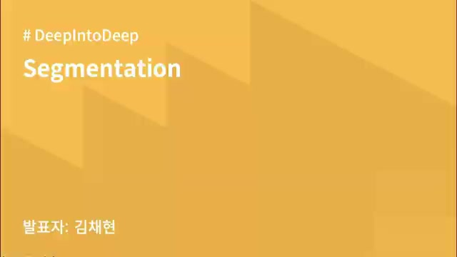
- 세그멘테이션은 이미지에서 객체가 차지하는 영역을 **마스크로 예측**하는 기술이다.

- 세그멘테이션의 정의는 오브젝트 디텍션에서 박스 안에 있는 객체의 **실루엣을 예측**하는 것으로 볼 수 있다.

- 세그멘테이션의 세 가지 주요 종류는 시멘틱, 인스턴스, 파노 세그멘테이션이다.

- **시멘틱 세그멘테이션**은 의미론적 단위(예: 사람, 강아지 등)를 하나의 마스크로 예측한다.

- **인스턴스 세그멘테이션**은 각각의 객체를 구분해 각각 다른 마스크로 예측한다.

- **파노 세그멘테이션**은 시멘틱과 인스턴스 세그멘테이션을 결합하여 객체와 배경을 모두 예측하는 기술이다.

### 2. 📊시멘틱 세그멘테이션의 기본 개념과 처리 방법

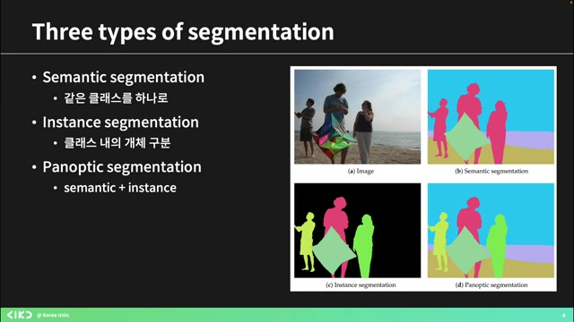
- 인스턴스를 분리하며 예측하는 **시멘틱 세그멘테이션** 테크닉에 대해 설명합니다.

- 시멘틱 세그멘테이션은 다양한 시멘틱 클래스에 속하는 픽셀을 예측하는 기본적인 태스크로, 여기서 픽셀은 사람, 자전거 등의 클래스로 분류됩니다.

- 이미지 내 픽셀들이 어떤 시멘틱 그룹에 속하는지를 예측하여 **전체 이미지를 마스크**처럼 영역을 구분합니다.

- 이 과정에서 모델의 아웃풋은 픽셀에 해당하는 클래스와 컨피던스 값을 포함하며, 이는 이미지의 각 픽셀을 숫자로 표현하여 클래스 classification을 수행하는 것입니다.

- 결국, 모델은 각 픽셀에 대한 마스크를 출력하며, 이는 세그멘테이션 모델에서 자주 나오는 결과 형식입니다.

### 3. 세그멘테이션 모델의 아웃풋과 COCO 데이터셋

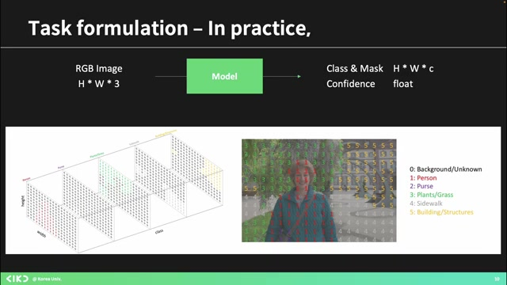
- H, W 클래스 개수만큼의 출력이 있는 런 마스크를 바이너리로 표현하며, 이는 각각의 클래스가 이미지에 속하는지 여부를 나타낸다.

- 바이너리 클래시피케이션은 특정 클래스일 확률을 단일 숫자로 제시하지만, 멀티 클래스는 각 클래스의 확률을 예측하며 그 합이 1이 된다.

- 세그멘테이션 모델은 H x W 사이즈의 매트릭스에서 클래스 개수만큼의 채널이 있는 텐서를 출력하고, 각 픽셀 자리에 속할 확률을 예측한다.

- 주요 데이터셋으로는 COCO가 있으며, 다양한 클래스 오브젝트와 함께 어노테이션된 마스크를 포함하고 있다.

- 세그멘테이션 모델의 성능을 확인하기 위해 정답지와 비교하여 평가하는 방식이다.

### 4. ️📊세그멘테이션 모델 및 학습 방법 소개

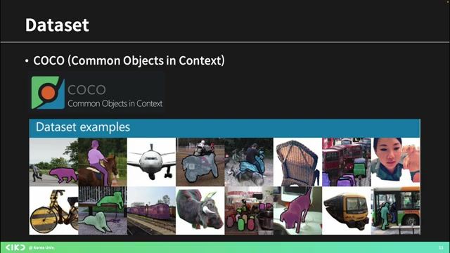
- 세그멘테이션에 대한 내용으로, 정답이 없는 모델도 존재하며, 기본적인 모델들은 COCO 데이터셋의 마스크 어노테이션을 사용하여 **지도 학습**을 진행한다.

- 소개한 모델은 약 두억 개 정도이며, 이들은 대부분 **감독 학습**을 사용하며, 최근 유명한 '세이' 모델은 스스로 마스크를 **리파인**하면서 학습한다.

- 세그멘테이션의 개념으로, 이미지와 클래스 개수에 따라 입력을 변환하고, 각 픽셀에 대해 가장 높은 확률을 가진 클래스를 예측하는 아맥스 오퍼레이션을 설명했다.

- 모델의 패턴 결과는 매트릭스 형태로 나타나며, 이 방식으로 결과를 쉽게 이해할 수 있다.

- 하지만 이러한 설계 방식은 문제를 야기할 수 있어, 더 나은 방법을 고민할 필요가 있다.

### 5. ️📊컨볼루션에서 피처 맵 사이즈 유지의 중요성

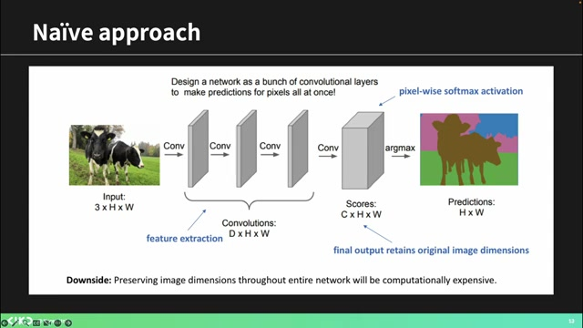
- 같은 크기의 컨볼루션을 계속하면 피처 맵의 사이즈는 변하지 않는다.

- 피처 맵 사이즈가 변경될 경우, 고차원적인 피처를 포착하기 어렵게 된다.

- 따라서 채널 수를 늘리고 피처 맵 사이즈를 줄이면 유용한 피처를 더욱 쉽게 추출할 수 있다.

- 채널 수가 깊어지면, 더 많은 정보가 담기게 되어 복잡한 피처를 잘 잡아낼 수 있다.

- 디셉티브 필드와 관련하여, 패딩이 없을 경우 리셉티브 필드의 사이즈에 대한 고려가 필요하다.

### 6. 세그멘테이션 모델에 대한 설계의 중요성

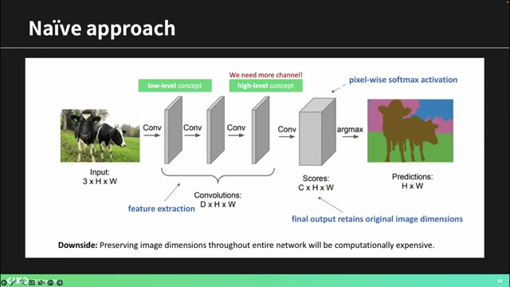
- 나는 루션의 공간적 정보를 활용하여, 주변 데이터와 함께 피처를 추출해야 한다고 강조했습니다.

- 그러나 현재 방법에서는 내 데이터만을 기준으로 하여 주변 데이터에 대한 정보를 활용하지 못하는 문제가 발생합니다.

- 설계 시 문제점으로는 채널이 얕을 경우 후반부에서 복잡한 피처를 잡기가 어려워지고, 컨볼루션에서 사이즈가 줄어들지 않아 공간적 의미 있는 피처를 포착하는 데 어려움이 있음을 언급했습니다.

- 또한, 지도 학습을 통해 로스를 계산해야 하는데, 세그멘테이션에서는 각 픽셀이 각 클래스에 속할 확률을 갖는 벡터를 통해 정답 레이블과 함께 크로스 엔트로피를 계산할 수 있습니다.

원문 스크립트 보기

주 못 고, 얘 요거 보고 여기 저, 또 약에 맨 밑에 가는 만 보고, 그다음 이런 식으로. 그러면 사실은 루션을 하는 이유는 그 공간적인 정보를 좀 사용해서 주변에 있는 애들이랑 내 정보를 같이 보면서 피처를 뽑아야 되는데, 이렇게 되면 내 것만 보고 계속 하니까 뭐 다른 공간적으로 좀 인접한 애들 정보를 못 쓰는 거죠. 이런 문제도 생깁니다. 그래서 어네이 사진 하나 가지고 한참 떠들었는데, 결국 결론은 뭐냐면 이런 식으로 설계하면 안 된다 이겁니다. 응, 그래서 거기에 생기는 문제 1번은 채널이 너무 얕으면 뒤로 갈수록 복잡한 피처를 잡기가 힘들다 이거고, 2번, 컨볼루션 했을 때 사이즈가 안 줄어들잖아요. 이렇게 계속 그냥 똑같이 가다 보면 공간적인 리브 필드가 좁기 때문에 후반부에 가서도 좀 공간적으로 의미 있는 피처를 잡기가 힘들다 하는 그런 문제가 있었던 겁니다. 좀 이해가 되시나요? 왜 안 될 것 같은지? 그래서 요런 식으로 이해를 해보시면 이제 다음 모델들이 왜 이런식으로 했는지 좀 이해를 하실 수 있을 것 같아요. 네, [음악] 그렇습니다. 음, 그리고 한 가지 좀 더 앞에 얘기를 하고 갈 만한 게, 그러면 만약에 저희가 네트워크를 그냥 트레이닝을 한다고 생각했을 때, 저희가 지금 하고 있는 게 지도 학습이라 생각하고, 답지가 있어요. 답지가 있고, 정답 마스크가 있고, 그리고 우리가 프레딕션한 저 이미지가 있어요. 그러면 로스 어떻게 해줄까요? 손실 함수가. 있어야 학습을 하잖아요. 어떻게 손실 함수를 줘야 이 모델이 세그멘테이션할 때 배울까요? 어, 회장님 약간 할 말이 많아 보이는데, 아니에요. 음, 이걸 생각해 보면 아까 클래시피케이션 얘기 잠깐 했었잖아요.. 클래시피케이션 개념을 별로 적용하면 좀 감히 올 거거든요. 그러니까 예를 들면 그런 겁니다. 내가 어, 그냥 클래시피케이션 생각해 보면 내가 이미지를 하나 딱 줬을 때 이 클래스가 0번 클래스라고, 여기에 그 뭐죠, 뭐 0번부터 5번까지 클래스가 있다고 가정하면 0번부터 5번까지 클래스에 속할 확률이 띡띡띡 나오죠. 뭐 6차원 벡터 있네요. 6차원 벡터 안에 확률 값들을 보고, 뭐 뭐 뭐 0.6, 0.2, 0.1, 0.1, 0 이런 식으로 나오겠죠. 그거라 정답 레이블이 0이었다면, 그러면은 여섯 개짜리 1, 그 6,000원짜리 벡터로 크로스 엔트로피를 계산할 수 있잖아요. 크로스 엔트로피 혹시 배우셨나요? 음, 그래서 그 멀티 클래스 클래시피케이션 하는 거랑 로스를 똑같이 줄 수 있습니다. 근데 그거를 이제 세그멘테이션이고 픽셀니까 각 픽셀에 관해서 줄 수 있는 거죠. 왜냐하면 하나 쏙 뽑으면 그게 각 픽셀이 각각의 클래스에 속할 확률을 담은 하나의 벡터가 되는 거니까. 그거랑 그다음에 정답 레이블 있잖아요.

### 7. 딥러닝에서의 크로스 엔트로피와 FCN 모델 소개

- 정답 레이블과 크로스 엔트로피를 사용하여 모델이 정답 레이블을 높은 확률로 예측하도록 학습할 수 있으며, 이는 CNN을 이용한 기본 세그멘테이션 아키텍처에서 사용되는 로스 함수이다.

- 그러나 이 과정에서 문제가 발생할 수 있어 이를 해결하기 위한 새로운 모델도 개발되었으며, 소프트맥스를 통해 각 픽셀의 확률값을 예측해야 한다.

- 모델은 인코더-디코더 구조를 갖고 있으며, 'FCN 네트워크'라는 이름으로 불린다; 이는 초기 시틱 세그멘테이션 논문에서 제안된 것이다.

- 이 모델에서는 입력 데이터가 인코딩되고, 중간에서 해상도가 줄어들었다가 다시 늘어나는 과정을 통해 더 복잡한 피쳐를 포착한다.

- 마지막으로, 논문에서 설명된 아키텍처의 모습은 입력 이미지가 점점 줄어드는 과정을 보여준다.

### 8. 세그멘테이션과 클래시피케이션 과정 설명

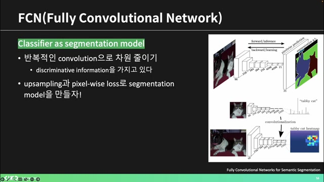
- 채널 수가 점차 늘어나고 줄어들며, 결국 21개의 클래스 수만큼의 채널을 통해 픽셀 와이즈 프레딕션을 생성한다.

- 이후 생성된 픽셀 와이즈 프레딕션은 정답지와 비교되어 세그멘테이션 작업을 진행하게 된다.

- 인코딩 단계에서 다운샘플링을 통해 피처 맵을 콤팩트하게 하여 더 의미 있는 정보를 캡처할 수 있도록 하며, 이러한 과정은 컨볼루션을 사용해 진행된다.

- 디컨볼루션을 통해 복원된 이미지의 사이즈는 증가하게 되고, 클래시피케이션과 세그멘테이션에 유용한 복잡한 피처 맵을 얻는다.

### 9. 디컨볼루션과 업샘플링 기법 설명

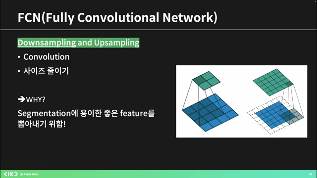
- 디컨볼루션은 3x3의 스페셜 공간 정보를 합쳐 아웃풋을 만드는 과정으로, 인풋은 특정 채널 필터의 그리드로 구성된다.

- 업샘플링은 여러 방법이 있는데, 간단히 매트릭스를 늘리는 방법으로 각각의 영역에 값을 부여하여 크기를 키울 수 있다.

- 두 번째 방법으로는 원래 자리에서 값을 채우고 나머지는 0으로 채우는 방식이 있으며, 맥스 풀링을 통해 풀링했던 자리의 값을 기억하고 다시 크기를 늘릴 수도 있다.

- 결론적으로, 다양한 업샘플링 방법이 있지만 디컨볼루션이 가장 효과적이며, 컨볼루션 필터의 학습을 통해 사이즈를 늘리는 것이 더 좋은 결과를 가져온다.

### 10. ️📈컨볼루션과 디콘볼루션을 통한 세그멘테이션 설명

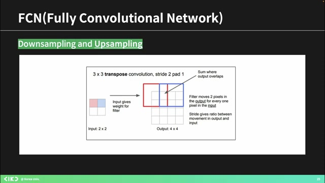
- 값을 필터링하고 겹친 부분은 더하여 **디콘볼루션**을 통해 아웃풋을 증가시킬 수 있다.

- 이를 통해 퓨처 맵의 사이즈를 픽셀 레벨로 확장할 수 있으며, 이 과정에서 **컨볼루션**과 **디콘볼루션**이 사용된다.

- 원바이원 컨볼루션을 적용하면 채널 사이즈가 줄어들며, 이를 통해 **특징**을 종합하여 세그멘테이션 결과를 생성하게 된다.

- 하지만 인코더와 디코더 과정에서 공간적인 정보가 무너져 고퀄리티 복원이 어려워진다는 문제점이 있다.

### 11. ️🔍FCN의 공간 정보 활용과 예측 정밀도 향상

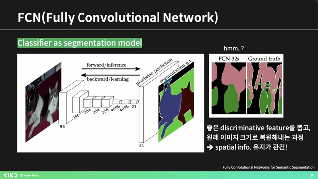
- FCN에서 **공간적인 정보**를 어떻게 활용할 수 있을지를 고민하며, 21차원 벡터 대신 초기의 큰 피처 맵들과 정보를 결합하는 방법을 제안한다.

- 이미지와 줄어든 피처 맵을 통해 컨볼루션을 수행할 때, 초기 차원 정보가 포함된 피처 맵을 활용해 마스크를 개선하는 전략을 사용한다.

- 작은 마스크를 업샘플링하는 과정에서 서로 다른 필터 사이즈를 적용하며, 예측한 클래스 확률 값을 각각 계산하여 결과를 합친다.

- 이런 방식으로 예측의 품질이 향상된다고 설명하며, 피처 맵의 업샘플링 정도를 통해 공간적 정보를 유지하는 과정을 이해시키려 한다.

- 질문이 있는지 확인하며, FCN 구조에서 숫자가 의미하는 바를 설명한다.

### 12. U-Net 아키텍처와 세그멘테이션 절차 소개

- U-Net은 **세그멘테이션 네트워크**로, 인코더와 디코더 구조를 가지고 있으며, 이미지 크기가 변형된 후 다시 복원되는 과정을 포함한다.

- 초기 피쳐들을 후방부에 보내는 기전을 통해 공간적인 정보가 보완되어 세그멘테이션 결과를 개선하는 역할을 한다.

- 특히 U-Net은 피쳐 맵을 만들 때 가장자리 정보가 손실될 수 있으므로, 중간 피처를 추가하여 보다 **정확한 성능**을 끌어내려고 설계되었다.

- 마지막으로, 더 궁금한 사항이나 질문은 논문 제목 참고를 통해 확인할 수 있음을 안내하며, 휴식 후 다음 주제로 넘어간다.

### 13. 마스크 R-CNN에 대한 설명과 차이점

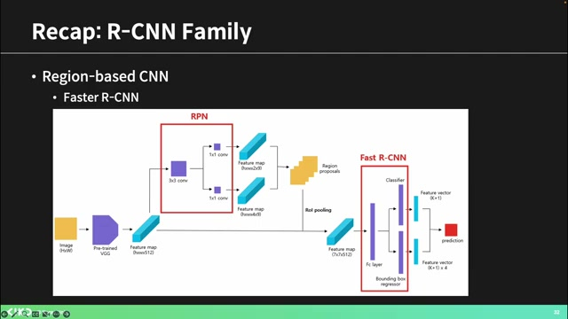
- 패스터 R-CNN은 오브젝트 디텍션 모델로서, 여러 바운딩 박스를 처리하여 유력한 리프레임을 생성하고, 이를 기반으로 클래스 예측과 바운딩 박스를 예측한다.

- 이번 모델의 핵심은 **마스크 브랜치**의 추가로, 클래스를 예측하고 바운딩 박스를 리그레이션하는 기능은 그대로 유지되며, 세그멘테이션 마스크 예측도 동시에 진행된다.

- 이 모델은 인스턴스 세그멘테이션을 위한 것으로, 각 객체를 디텍션하여 인스턴스의 세그멘테이션 마스크까지 얻을 수 있다.

- 또한, 패스터 R-CNN에서 사용된 ROI 풀링 대신 새로운 방식인 ROI 라인을 사용하여 피처를 추출하는 방법을 적용한다.

### 14. ROI 풀링의 정확성을 높이는 방법 설명

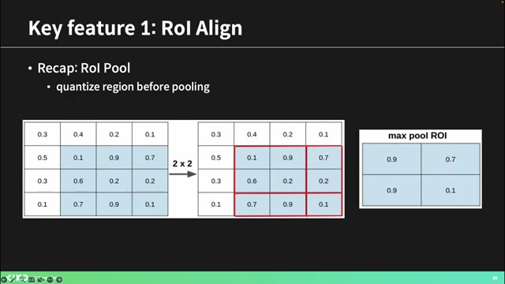
- 애매하게 박스가 쳐진 상태에서도, 가장 적합한 그리드를 찾아 시뮬레이션을 진행하는 것이 중요하다.

- 객체 탐지를 할 때는 마스크가 필요 없고, 박스만 찾으면 되지만, 위치 정보를 정확히 반영하기 위해서는 ROI 풀링을 통해 피처를 더욱 정확하게 추출해야 한다.

- 각각의 그리드를 나누고, 포인트의 피처를 인터폴레이션하여 더 정확한 값을 도출해 내는 것이 R라인의 목표이다.

- 최종적으로 이렇게 얻은 정확한 피처들은 기존 방법과 차이를 보이며, 부정확한 피처를 개선하기 위한 것이다.

- 두 번째로, 로스 펑션은 FCN의 픽셀별 클래시피케이션과는 달리, 마스크 R-CNN에서는 다른 접근 방식을 채택한다.

### 15. 클래시피케이션 방법의 차이점 이해하기

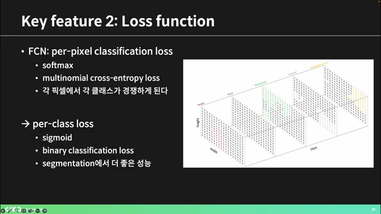
- 클래시피케이션에는 멀티클래스와 바이너리 클래시피케이션의 두 가지 방식이 있다.

- 멀티클래스에서는 세 클래스의 확률을 합쳐 소프트맥스를 통해 하나의 클래스를 예측하지만, 바이너리 클래시피케이션은 각 클래스별로 마스크를 생성하여 확률을 표현한다.

- 멀티클래스에서는 하나의 클래스 확률이 높아지면 나머지 클래스의 확률이 떨어지는 현상이 발생하여 학습에 부정적인 영향을 줄 수 있다.

- 따라서, 각각의 클래스가 독립적으로 학습할 수 있도록 바이너리 클래시피케이션을 적용하여 로스를 주면 더 효과적인 학습이 가능하다.

- 앞서 언급한 방법을 통해 각 클래스마다 영향 없이 예측을 수행할 수 있다.

### 16. 피처 피라미드 네트워크(FPN)의 기본 개념

- 세 번째 개념은 **FPN**으로, 피처 피라미드 네트워크를 설명하겠다.

- 이 네트워크는 다양한 스케일의 피처 맵을 사용하며, 초기 로우 레벨의 피처에서부터 단계적으로 하이 레벨의 피처로 진행된다.

- 피라미드 구조를 통해 여러 스케일의 피처를 모아 사용함으로써 더욱 **정확**하고 퀄리티 높은 결과를 목표로 한다.

- 마스크 사용과 동시에 각각의 스케일에서 처리한 결과를 RPN에 보내어 클래스와 바운딩 박스를 아웃풋하는 방식으로 작동한다.

- 종합적으로, 패스트 RCNN의 방식과 유사하나 마스크 브랜치가 추가되고, ROI 풀링을 보다 정확하게 수행하는 방법도 포함된다.

### 17. ️🖥️디텍션 트랜스포머와 마스크 포머 소개

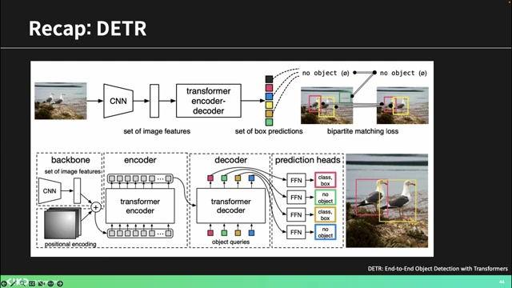
- 디텍션 트랜스포머는 CNN 피처를 사용하며, 이를 통해 **오브젝트 프로포절**을 생성한다.

- 바이타 매칭을 통한 로스 계산 방법을 설명하자면, 정답과 비교할 대상을 결정하여 가는 방식으로, 헝가리안 매칭 알고리즘을 사용하면 빠르게 이루어진다.

- 마스크 포머는 **픽셀 분류** 방식을 뒤집어 마스크의 퀄리티를 높이는 로스를 적용하고, 각 마스크의 정답 레이블을 찾는다.

- 이 구조는 CNN과 트랜스포머 인코더, 디코더를 결합하여 이미지 세그멘테이션을 수행하며, 마스크 임베딩을 통해 중요한 피처를 예측한다.

### 18. ️‍💻이미지 피처를 활용한 마스킹 및 클래시피케이션

- 주된 아웃풋은 이미지 피처를 추출하여 디코더를 통해 오브젝트 프로포절을 생성하고, 마스크와 클래스를 예측하는 것이다.

- 세그멘테이션 마스크를 만들기 위해서는 클래스 예측 관련 로스와 마스크 임베드 사이즈를 고려해야 하며, 이는 프로포절의 수를 나타낸다.

- 픽셀 디코더는 이미지의 공간적 정보를 사용하여 각 마스크를 복원하고, 각 픽셀마다 C 차원짜리 피처 맵이 존재함을 이해해야 한다.

- 마스킹 벡터를 이용해 비슷한 프로포절의 임베딩을 찾아 마스크 픽셀 레벨에서 클래스를 예측하게 되며, 이는 최종적으로 바이너리 마스크 로스로 이어진다.

- CNN은 직관적 원리에 기반하여 작동하므로 이러한 과정을 이해하는 것이 중요하다.

### 19. 트랜스포머 기반 이미지 세그멘테이션 모델 소개

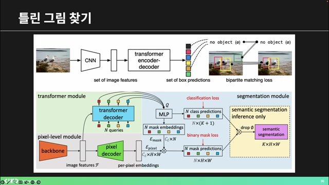
- 트랜스포머는 명쾌하게 직관적이지 않지만, DTRR 베이스로 마스크 포맷을 활용한 분류가 가능하다.

- 픽셀 디코더와 마스크 베딩을 활용한 마스크 프레딕션 부분이 **특별한** 차별점으로 여겨진다.

- 이미지 관련 피처를 뽑아내고 오브젝트를 디텍션하는 모듈이 있으며, 마지막 세그멘테이션 모듈은 MLP를 통해 클래스와 마스크를 예측한다.

- 세그먼트니라는 메타의 핫한 모델이 세그멘테이션을 수행하며, 특정 프롬프트에 따라 잘 작동한다.

- 이 모델은 프롬프트 인코딩과 이미지 인코딩, 마스크 디코딩을 통해 효과적인 세그멘테이션을 제공한다.

### 20. 📊모델 세그멘테이션의 새로운 방식과 활용

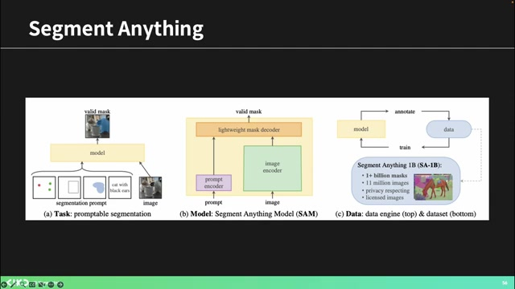
- 이 모델은 **지도 학습과 비지도 학습**을 결합하여 작동하며, 대량의 데이터를 사용합니다.

- 초기에 일부 사람이 주석을 달은 데이터로 모델을 학습시킨 후, 모델이 생성한 주석을 다시 활용하여 성능을 향상시키는 방식입니다.

- 이러한 방법은 비대학교 데이터와 함께 실시간 세그멘테이션에 매우 유용하며, 자율 주행 및 바이오메디컬 분야에서도 널리 쓰입니다.

- 모델은 다양한 스케일의 마스크를 출력할 수 있어, 여러 방식으로 결과를 개선할 수 있는 특징을 가지고 있습니다.

- 결과적으로 이는 자동으로 세그멘테이션을 수행하고 다양한 물체에 대한 주석을 제공하는 **매우 빠르고 효율적인** 도구입니다.

### 21. 신기한 실시간 세그멘테이션 데모 소개

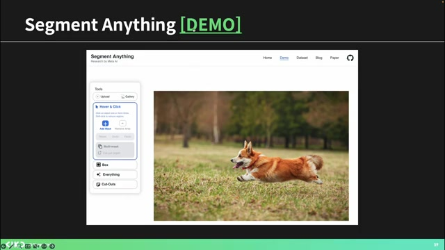
- 사용자는 데모에 들어가 약관에 동의한 후 이미지를 업로드할 수 있으며, 프롬프트를 통해 세그멘테이션 마스크를 설정할 수 있다.

- 실시간으로 빠르게 작동하며 오브젝트를 잘 잡아내는 기능을 가지고 있으며, 자동 생성된 점들을 통해 모든 픽셀을 세그멘테이션하는 기능을 제시한다.

- 약 1년 전부터 활성화된 이 모델은 바이오메디컬 분야에서 많이 사용되고 있다.

- 최근에는 비디오 세그멘테이션 모델이 출시되어, 프롬프트를 통해 비디오를 실시간으로 세그멘테이션 할 수 있는 혁신적인 기능을 제공한다.

- 비디오에서 메모리 모듈을 사용하여 시간에 따른 물체의 위치 변화를 추적하고 세그멘테이션을 수행할 수 있다.

### 22. 비디오 세그멘테이션의 혁신과 클립 모델 활용

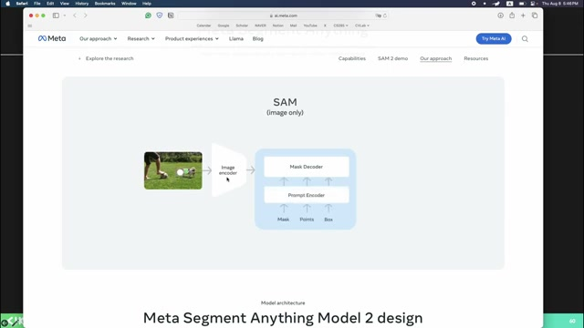
- 비디오 세그멘테이션은 **이동하는 객체를 추적**하고 이를 기반으로 세그멘테이션을 수행하는 과정을 포함한다.

- 각 프레임에서 객체의 피처 맵을 풀링하여 메모리에 저장하고, 다음 프레임의 세그멘테이션 시 이 피처를 비교하여 일관성 있게 작업을 진행한다.

- 최근에는 **리얼타임 세그멘테이션**과 오픈 보캐블러리 세그멘테이션이 부각되며, 다양한 클래스에서 작업이 가능해졌다.

- 특히 클립 모델을 사용하면 방대한 데이터로 학습된 시맨틱 정보를 활용해 새로운 클래스에 대해 더욱 나은 세그멘테이션이 가능해진다.

- 저는 컴퓨터 비주얼 랩에서 이와 관련된 연구를 진행하며 클립의 지식을 통해 세그멘테이션의 발전을 경험했다.

### 23. 오픈 보이 세그멘테이션의 신기한 사례들

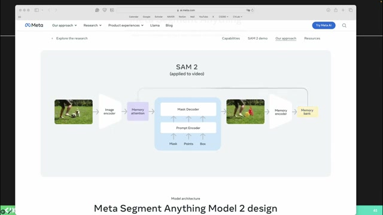
- 연구실에서 발표된 내용 중 세그멘테이션에 대한 신기한 현상을 소개한다.

- 클립의 텍스트와 이미지 벡터를 사용하여 특정 단어를 세그멘테이션할 수 있으며, 예를 들어 '우산'을 정보를 기반으로 벡터로 만들고 이를 다시 비교하여 정확한 위치를 찾는 과정을 설명한다.

- 트레이닝 데이터에 없는 단어인 '양캣'조차 세그멘테이션이 가능하다는 점이 흥미롭고, '토로코 아이스'와 같은 형태의 글자도 성공적으로 세그멘테이션한다.

- 또한 일반적인 사진이 아닌 게임 이미지에서도 유효한 세그멘테이션 결과를 도출할 수 있는데, 이는 다양한 스타일에 대한 유연한 적용을 의미한다.

- 마지막으로, 사람 숫자에 따라 중간에 있는 사람이나 특정 개체를 세그멘테이션해내는 모델들이 개발되고 있다.

### 24. 세그멘테이션 연구의 발전과 사용 분야

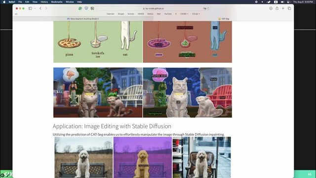
- 최근 세그멘테이션은 메디컬 이미지에서 **세포분리**와 같은 분야에 많이 사용되고 있다.

- 또한, 반도체 공정 과정에서 제품의 품질을 평가하는 **분류 작업**에 세그멘테이션이 활용된다.

- 이런 필요性에 따라 특화된 세그멘테이션 모델이 연구 논문으로 많이 발표되고 있으며, 새로운 트렌드가 형성되고 있다.

- 특히 최근 들어 시멘틱, 인스턴스, 옵틱 등 다양한 세그멘테이션 태스크들이 나타나고 있다는 점이 주목할 만하다.

- 제 발표는 여기까지이며, 질문이 있으시면 개인적으로 오셔서 문의해 주시기 바란다.

