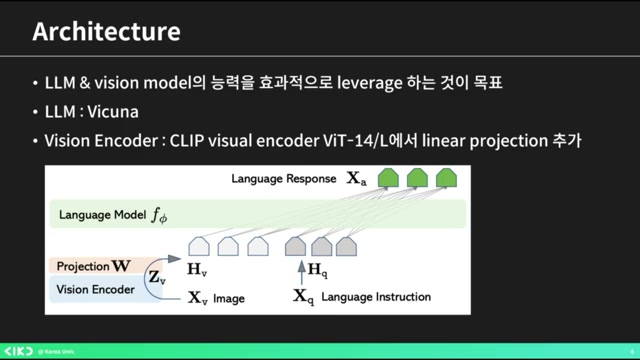
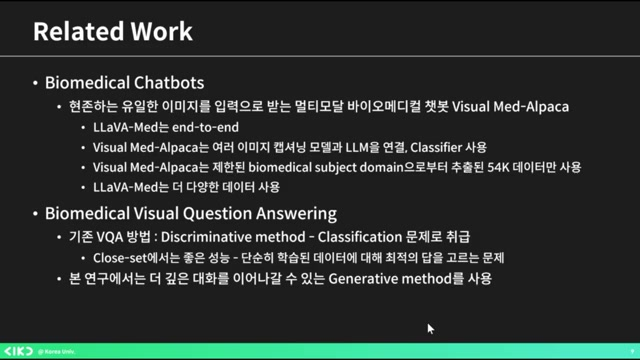
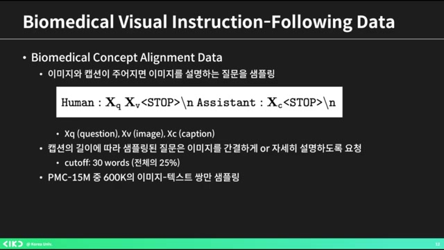
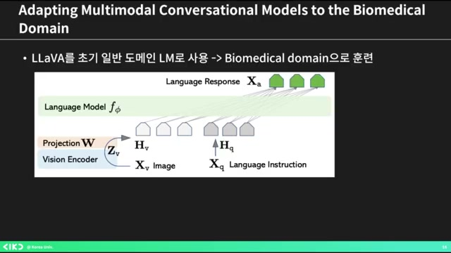
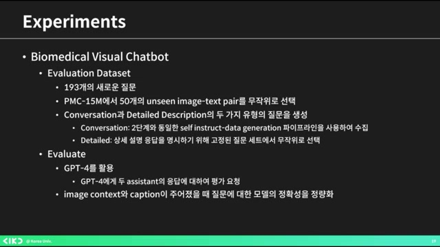
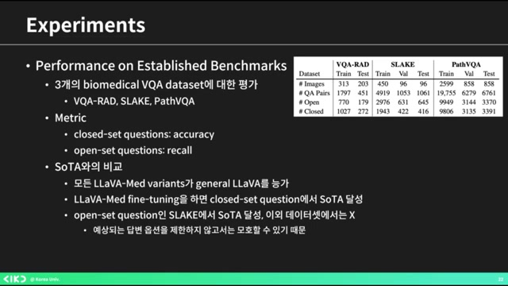
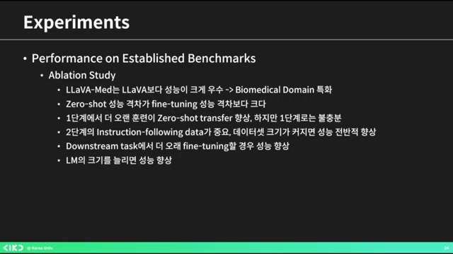

# AIKU 24-2 Momentum 5회 LLaVA-Mededit

흥미로운 내용 3가지 :

- 라바(LLaVA)는 '라지 랭귀지 비전 어시스턴트'의 약자다.
- 이미지 캡션과 바운딩 박스 값을 활용해 대화 세트를 생성한다.
- 바이오메디컬 이미지 처리에서 제너럴 도메인 데이터로만 학습되어 성능을 높이는 노력이 필요하다.

이 영상은 '라바 매드'라는 생명과학 분야의 최신 AI 모델에 대한 발표로, 모델의 구조와 데이터 생성 과정을 자세히 설명합니다. 이 모델은 바이오메디컬 이미지를 이해하고 대화할 수 있는 능력을 갖추도록 설계되었습니다. 이를 통해 기존 모델의 한계를 극복하고 전문적인 지식을 요구하는 질문에 잘 응답하도록 훈련되었습니다. 결론적으로, 영상은 AI가 어떻게 도메인 특화된 지식을 습득하여 실제 응용 가능성을 높이는지를 보여주는 주제를 다루고 있습니다.

## 핵심주제

LLaVA-Med는 **바이오메디컬** 이미지 처리에 특화된 **멀티모달** AI 모델이다.

- LLaVA는 '라지 랭귀지 비전 어시스턴트'의 약자로, 바이오메디컬 이미지에서의 Q&A 생성을 목표로 한다.

- 이 모델은 이미지 캡션과 바운딩 박스 정보를 활용하여 질문과 대화 세트를 생성할 수 있다.

- 기존의 멀티모달 스크립트의 한계를 극복하기 위해 설계되었다.

기존 **VQA**의 한계를 극복하기 위해 **제너레이티브** 방법이 도입되었다.

- 기존 VQA 방법은 답변 선택에 한정되어 있으나, 제너레이티브 방법은 오픈엔디드 대화를 가능하게 한다.

- 모델은 이미지와 텍스트 데이터를 바탕으로 GPT-4를 이용해 바이오메디컬 데이터를 생성한다.

- 이 과정은 머신과 휴먼 협력을 통해 새로운 데이터셋을 만드는 것을 포함한다.

바이오메디컬 데이터 품질 개선을 위해 **캡션 활용**이 중요하다.

- 캡션의 길이에 따라 질문의 구체성을 달리하여 질문-답변 세트를 생성한다.

- 데이터 품질을 개선하기 위해 여러 버전의 데이터를 생성하며, 이미지를 활용한 대화를 이끌어낸다.

- 이러한 방식으로 충분한 데이터 수집과 품질 개선이 이루어진다.

모델의 **정확성 평가**는 성능 비교에 초점을 맞추고 있다.

- 모델의 대화 능력은 단계적으로 향상되며, 훈련 데이터의 양에 의해 성능이 좋아진다.

- LLaVA-Med는 사용자의 질문에 대해 구체적인 답변을 제공하며, 기존 LLaVA와 비교해 월등한 성과를 보인다.

- 정성적 및 정량적 평가를 통한 성능 검증이 이루어진다.

**파인튜닝** 과정이 모델 성능 향상에 중요한 역할을 한다.

- 파인튜닝 시간을 늘리면 모델 성능이 향상되며, 이는 예측 가능한 결과다.

- 바이오메디컬 분야에서 인스트럭션 팔로잉 데이터셋을 효과적으로 생성하는 데 기여했다.

- 할루시네이션과 인덱스 문제 등 여전히 해결해야 할 과제가 존재한다.

## 타임라인

### 1. 📘 LLaVA-Med 모델 소개

- 라바(LLaVA)는 **'라지 랭귀지 비전 어시스턴트'**의 약자다.

- 이 논문은 기존 멀티모달 스크립트의 한계를 극복하기 위해 설계되었다.

- 사용자는 이미지의 캡션과 바운딩 박스 값을 넣어 질문과 대화 세트를 생성한다.

- 데이터는 간단한 질문 답변, 상세한 설명 요구, 그리고 추론이 필요할 경우의 세 가지 타입으로 구성된다.

- 목표는 LM(언어 모델) 비전 모델의 능력을 효과적으로 활용하는 것이다.

### 2. AI 모델의 발전과 바이오메디컬 이미지 문제

- 파인 튜닝된 큐를 사용하고 비전 인코더로 클립 비주얼 인코더를 적용했으며, 마지막 레이어를 리니어 프로젝션으로 변경했다.

- 제너럴 도메인 생성 대화형 생성 AI 멀티모달 모델이 발전 중이나, 도메인 스페시픽한 부분은 **부족하다는** 이야기가 있다.

- 사람들은 바이오메디컬 이미지에 집중했으나, 제너럴 도메인 데이터로만 학습되어 이해력과 대화 능력이 매우 떨어지는 문제가 존재한다.

- 이에 대한 해결책으로 이미지를 묻고 답할 수 있는 오픈엔디드 리서치를 제안하며, 바이오메디컬 책과 같은 연구가 언급된다.

- 라바 메드는 엔드투엔드인 반면, 비주얼 매드 알파카는 이미지 캡셔닝 모델과 L&M을 연결하여 클래스파이어를 사용하므로 차이가 있다.

### 3. ️🔍VQA의 한계를 극복하기 위한 제너레이티브 방법

- 기존의 VQA 방법은 **그리스크리스**에서 좋은 성능을 보이는 반면, 최적의 답을 고르는 문제에 그칩니다.

- 이 영상에서는 **오픈엔디드** 대화를 이어가기 위해 제너레이티브 메소드를 활용합니다.

- 모델 아키텍처는 **랭기지 모델의 프리픽스 튜닝**과 유사하며, 리니어 프로젝션을 사용하고 매드라 해는데, 메디컬 쪽 논문 데이터가 존재합니다.

- 이곳에서 추출된 이미지와 텍스트를 바탕으로 GPT-4로 **셀프 인스트럭터** 바이오메디컬 데이터를 생성하는 점이 특이합니다.

- 바이오메디컬 비주얼 인스트럭션 페어링 데이터는 부족한 멀티모달 바이오메디컬 데이터셋을 보완하기 위해 머신과 휴먼이 협력하여 새로운 데이터셋을 생성하는 과정을 포함하고 있습니다.

### 4. 바이오메디컬 데이터 품질 개선 및 캡션 활용

- 캡션의 길이에 따라 질문을 간결하게 또는 자세히 설명하였으며, **캡션은 30단어에서 분으로 이루어졌다**.

- PMC 15M 중 600K를 사용했으며, 바이오메디컬 이미지에 대한 Q&A 생성 요청을 GPT-4 모델을 통해 진행하였다.

- 이미지가 너무 짧지 않도록 **포맷 논문에서 관련 문장을** 가져와 사용하며, 데이터 품질을 개선하기 위해 세 가지 버전을 만들었다.

- 인라인 맨션을 컨텍스트로 간주하여 생성 시 사용된 데이터는 60K였으며, 추가로 10K 이하의 작은 데이터로 총 세 개의 데이터를 만들었다.

- 이러한 방식으로 이미지와 캡션을 활용하여 대화가 생성된다.

### 5. 모델 그림과 바이오메디컬 도메인 훈련 과정 설명

- 모델 그림은 일반 도메인 LM을 사용해 바이오메디컬 도메인으로 훈련되었으며, 현재 모델 그림은 라바 그림이다.

- 훈련 과정은 두 가지 단계로 나뉘며, 첫 번째 단계는 바이오메디컬 개념과 피처 라인트를 활용하여 PCM 15를 필터링하는 것이다.

- 두 번째 단계에서는 엔드 투 엔드 인스트럭션 튜닝을 진행하며, 비주얼 인코더 가중치는 고정하고, 프로젝션 레이어와 사전 학습된 가중치를 사용하여 바이오메디컬 언어와 이미지 데이터를 파인 튜닝한다.

- 마지막으로, 평가 데이터셋은 193개의 새로운 질문으로 구성되며, GPT-4을 활용해 모델의 응답을 평가한다.

### 6. 모델의 정확성 평가 및 성능 비교

- 이 모델은 이미지 컨텍스트와 캡션이 주어졌을 때 질문에 대한 정확성을 수치적으로 나타내고자 한다.

- 1단계 학습으로는 약간의 메디컬 지식이 있지만 대화 능력은 떨어지며, 2단계 학습을 통해 더 우수한 성능을 발휘한다.

- 인스트럭션 데이터가 늘어날수록 성능이 좋아지는 것을 확인할 수 있다.

- 정성적 평가에서도 LLaVA-Med가 사용자의 질문에 대해 훨씬 더 구체적으로 잘 설명하며, 기존 일반 모델인 LLaVA와 비교할 때 확연한 차이를 보인다.

- 마지막으로 기존 벤치마크에 대한 성능도 평가하게 된다.

### 7. ️📊바이오메디컬 VQA 데이터의 성능 비교

- 바이오메디컬 VQA 데이터는 VQA, 아드 슬레이크, 패스 VQA로 나뉘며, 레이크는 **오픈 셋 질문**이 있고 나머지는 **클로즈 셋 질문**이다.

- 클로즈셋 질문은 정확도로 평가되고 오픈 질문은 리콜로 측정되며, LLaVA 변형이 일반 LLaVA보다 성능이 뛰어난 것으로 나타났다.

- LLaVA는 일반인 수준의 의학 지식을 가지고 있지만, 변형된 LLaVA는 의학적 지식으로 학습되어 어느 정도 의학적 지식을 가진 모델이 되었다.

- 파인 튜닝을 통해 클로즈 셋 질문에서 소타를 달성하며, 오픈 셋 질문의 경우 슬레이크 소를 성취했지만, 다른 오픈 셋 질문에 대한 성취는 미흡했다.

- 데이터가 커지면 성능이 향상되는 것을 확인했으며, 2단계 인스트럭션 팔로잉 데이터의 중요성도 강조되었다.

### 8. ️🧠파인튜닝과 모델 성능 향상에 대한 논의

- **파인튜닝**을 오래하면 기본적으로 모델 성능이 향상된다.

- 모델(LM)이 커질수록 성능이 역시 향상된다는 점은 예측 가능한 결과로 보인다.

- 예를 들어, 중국어 질문을 라바에 주었을 때, 라바는 비록 중국어로 된 인스트럭션 팔로잉 데이터는 없지만, 제대로 답변하는 모습을 보인다.

- 결론적으로, 바이오메디컬 분야에서 높은 수준의 인스트럭션 팔로잉 데이터셋을 생성하기 위해 셀프 인스트럭쳐 어프로치를 이용했다고 한다.

- 그러나 모든 모델에서처럼 할루시네이션과 인덱스 문제는 여전히 존재한다고 언급된다.

