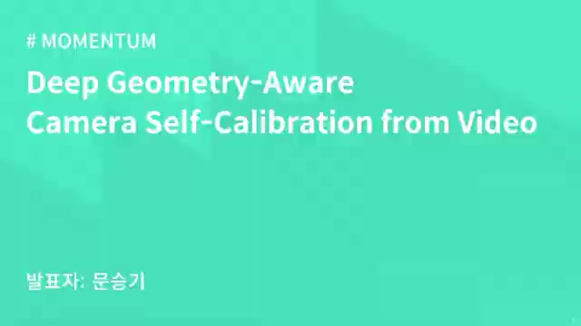
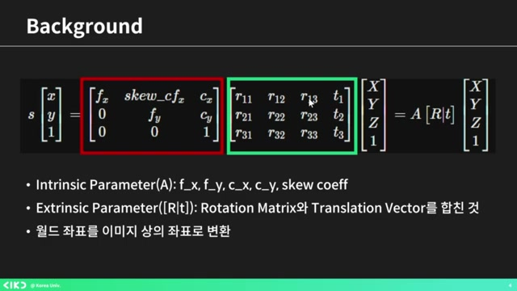
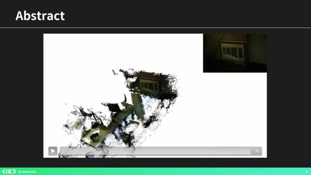
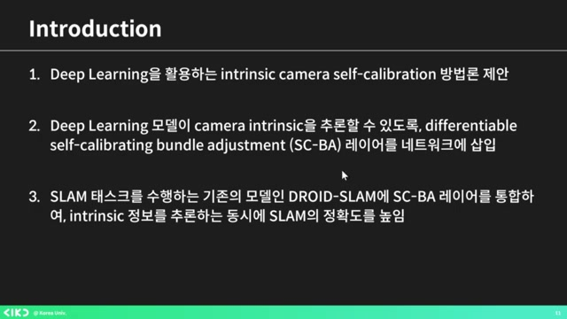
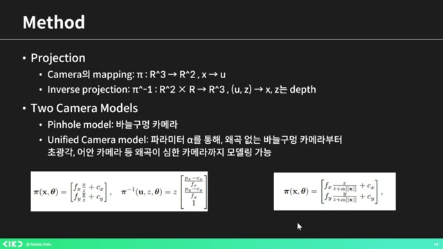
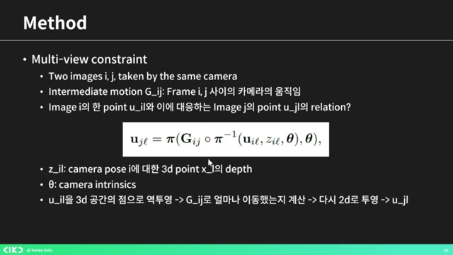
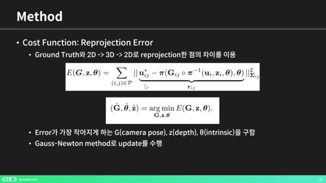
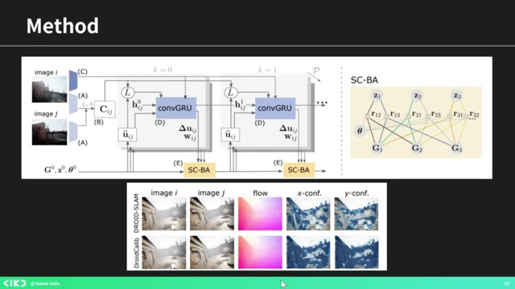
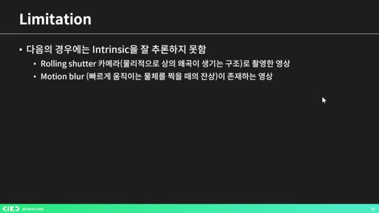

# 비디오에서 AIKU 24-2 모멘텀 5회 딥 지오메트리 인식 카메라 자체 보정하기

흥미로운 내용 3가지 :

- 카메라 셀프 캘리브레이션은 딥 러닝을 이용해 카메라 내부 파라미터를 추정하는 기술.
- 셀프 클레인레이션 과정에서 이미지 페어를 이용하여 인트린직을 추론하는 방법 제안.
- SCB 레이어 통합을 통해 정확성을 높이고 외곡을 반영한 카메라 모델 개발.

이번 발표는 카메라 셀프 캘리브레이션 기술에 대한 내용을 다룹니다. 특히, 딥 러닝을 활용하여 비디오만으로 카메라의 내부 파라미터를 추정하는 방법을 제시하며, 일반적인 카메라 캘리브레이션의 한계를 넘어설 수 있는 가능성을 보여줍니다. 기존의 타겟이 필요 없는 새로운 접근법을 통해, 카메라의 위치와 회전을 동시에 추론할 수 있어 자율주행차 및 다양한 응용 분야에서 유용할 것으로 기대됩니다.

## 핵심주제

딥 **지오메트리** 어웨어 카메라 셀프 캘리브레이션 기술에 대한 성과가 주목받고 있다.

- 이 기술은 **비디오**만으로 카메라의 인트린직 파라미터를 추정할 수 있는 방법을 제시한다.

- 특히 **모노큘러 비디오**에서 인트린직 예측을 구현함으로써 자율주행 자동차와 같은 응용 분야에 기여한다.

- 비주얼 SLAM 시스템을 활용해 셀프 캘리브레이션 스텝을 추가함으로써 이 문제를 해결하고 있다.

이미지 **페어**를 통한 셀프 캘리브레이션 과정이 중요하다.

- 입력으로 사용되는 각각의 **이미지**에는 겹치는 부분이 반드시 필요하다.

- 모델은 이미지 A의 픽셀을 바탕으로 이미지 B의 대응 픽셀을 추론하고, 그 결과를 3D 좌표로 변환한다.

- 이 과정에서 **컨피던스 웨이트**를 계산해 추론의 신뢰도를 높인다.

SCB 레이어의 통합을 통해 카메라 **정확성**을 향상시켰다.

- SCB 레이어를 통해 인트린직을 추정하는 과정은 이미지상의 점의 정확한 위치를 보정하는 데 도움을 준다.

- 이 모델은 다양한 광선을 분석해 객체의 위치를 더욱 정교하게 추론할 수 있게 한다.

- 카메라의 **왜곡**을 반영하기 위한 유니파이드 카메라 모델도 사용하며, 파라미터 알파를 설정한다.

촬영 시 발생하는 **외곡** 문제를 해결하기 위한 접근 방식이 제안되었다.

- 촬영 중 외곡이나 빠른 카메라 이동으로 인해 잔상 문제를 해결하기 위한 새로운 기술이 개발되었다.

- 리테이션과 컨클루전 같은 방법이 단일 비디오로 카메라 위치를 추정하는 가능성을 보여준다.

- 기존 타겟 없이도 3D 역변환이 가능하다는 점이 이 기술의 중요성을 더욱 부각시킨다.

딥러닝을 활용한 카메라 **보정** 방법이 성과를 보이고 있다.

- 딥러닝 기술을 통해 카메라의 인트린직 파라미터를 더 정확하게 추정할 수 있게 되었다.

- 네트워크의 레이어를 삽입함으로써 기존의 여러 접근 방식을 결합하여 인식 기능을 함께 추정할 수 있게 되었다.

- 모델은 드로이드 슬램과 같은 기존 모델과의 결합을 통해 성능을 크게 향상시켰다.

## 타임라인

### 1. 📷 카메라 셀프 캘리브레이션의 개요

- **카메라 셀프 캘리브레이션**은 비디오만으로 카메라의 내부 파라미터를 추정하는 기술이다.

- 이 기술은 **딥 러닝**을 활용하여 2D 좌표를 3D로 역변환하기 위해 필요하다.

- **카메라 내부 파라미터**(인트린식)에는 렌즈와 이미지 센서 사이의 거리, 초점거리, 이미지 센서의 기울기 등이 포함된다.

- **카메라 외부 파라미터**(익스트린식)란 카메라의 위치 및 회전 정보를 의미한다.

- 행렬 연산을 통해 2D 이미지를 3D 좌표로 변환할 수 있다.

### 2. 딥 지오메트리 어웨어 카메라 셀프 칼리브레이션 논문 소개

- 이 논문은 **비디오**만 보고 카메라의 인트린직 파라미터를 알아내는 방법을 제시합니다.

- 3D 월드 정보를 구성하기 위해 인트린직을 알아야 하며, 인트 캘리브레이션 통해 이를 찾아가는 과정을 설명합니다.

- 특히 **모노큘러 비디오**만 보고 인트린직 예측하는 것은 어려운 작업이지만, 이 논문의 저자들은 비주얼 SLAM 시스템에 셀프 칼리브레이션 스텝을 추가하여 해결책을 제안했습니다.

- SLAM은 자율주행 자동차에 들어가는 기술로, 위치 추정과 지도 생성을 통해 주위 환경을 분석하는 과정을 포함합니다.

- 카메라의 위치를 트래킹하며 주위의 월드를 재구성하는 방법을 보여주는 슬라이드를 예로 들 수 있습니다.

### 3. 📷 카메라 보정 방법 및 딥러닝 활용

- 캘리브레이션을 통해 카메라의 **인트린직 파라미터**를 얻는다.

- 리퍼런스 타겟인 바둑판 무늬를 촬영하여 기울어짐과 왜곡을 역 연산으로 분석한다.

- 때로는 이미지나 이미지 시퀀스를 통해 대상 없이도 인트린직을 **추론**할 수 있는 방법을 제안했다.

- 딥러닝을 활용한 방법은 기존의 여러 접근 방식과 함께, 네트워크에 레이어를 삽입해 인식을 함께 추정하도록 발전했다.

- 기존 모델인 **드로이드 슬고**와 함께 이를 구현하여 성능을 향상시켰다.

### 4. SCB 레이어 통합을 통한 정확성 향상

- 모델에 SCB 레이어를 통합하여 인트린직을 추정함으로써 **정확성**을 높였다고 볼 수 있습니다.

- 셀프 클레인레이션 번 조정 모델은 다양한 광선을 분석해 점의 정확한 위치를 보정하는 과정을 포함합니다.

- 각 시점에 대한 여러 광선의 방향을 파악하여 이미지상의 점의 정확한 위치를 역으로 추론하는 방식입니다.

- 또한, 카메라 왜곡을 반영하기 위해 유니파이드 카메라 모델을 사용하며, 왜곡 정도를 나타내는 파라미터 알파가 존재합니다.

### 5. 렌즈 왜곡과 멀티뷰 컨스트레인트 이해하기

- 렌즈의 왜곡 정도는 특정 파라미터를 통해 확인할 수 있다.

- 멀티뷰 컨스트레인트는 다양한 시점에서 동일 물체를 바라본 이미지를 쌍으로 만들어, 그 물체의 점의 정확한 위치를 파악하는 방법이다.

- 입력으로 동일 카메라로 촬영한 두 개의 이미지 A를 사용하며, 카메라의 모션도 포함된다.

- 각 프레임 사이의 모션을 고려하여, 이미지 A의 특정 포인트를 u_il로 정의하고, 대응하는 점을 UJL로 명명한다.

- 이 관계는 역변환을 통해 3D 좌표로 바뀌며, 카메라가 움직임에 따라 점도 함께 이동해야 한다.

### 6. 이미지 페어를 통한 신뢰도 계산 및 오류 수정 과정

- 파일을 통해 D로 투영시킨 후, 결과값을 그라운드 트루스와 비교하여 얼마나 달라졌는지를 확인하고 학습을 진행한다.

- 셀프 캘리브레이션 과정에서 인풋은 **이미지 페어**로, 각 이미지에는 겹치는 부분이 있어야 한다.

- 모델은 이미지 A의 모든 픽셀에 대해 이미지 B의 대응하는 픽셀을 추론하는 방식으로 뉴럴 네트워크를 사용한다.

- 추론의 신뢰성을 나타내는 컨피던스 웨이트를 계산한 후, 3D 좌표로 변환하여 카메라의 무브먼트를 적용한다.

- 모든 타일을 계산하여 오류를 찾아내는 과정을 진행한다.

### 7. 드로이드 슬램 모델에 SCBA 레이어 적용

- 학습을 위해 **가장 적은 에러**를 발생시키는 세 가지 요소를 찾아야 하며, 업데이트는 가우스 뉴턴 메소드로 수행한다.

- 드로이드 슬램은 SLAM 테스크를 수행하는 것이며, 리하게 추정을 실제로 사용하고 있다.

- 드 슬램 내의 스트라 레이어를 저자들이 개발한 SCBA로 교체했으며, 이미지 페어를 받아 CNN을 통해 피처를 추출한다.

- 그 다음, 피처 간의 상관관계를 계산하고, 트레인의 초기값을 정한 후, **반복적으로 업데이트**를 수행한다.

- 이 과정에서 이미지의 플로우를 추정하고, 번더 어저스트먼트를 진행하게 된다.

### 8. 드로이드 슬램 모델의 성능 및 한계 분석

- 연속된 프레임을 통해 픽셀의 속도를 **추론**하고, 이를 시각적으로 나타내는 매트릭스를 활용해 x와 y 방향에서의 값을 반영한다.

- 드로이드 슬램을 적용한 모델 다이어그램에서 업데이트를 확인할 수 있으며, 인식 기능이 함께 추가되었다.

- 실험 결과 다양한 데이터셋을 사용하여 픽셀 재매핑을 통해 그라운드 트루스와 차이를 분석하고, 모델이 디스토션에도 잘 작동하는 것을 보여준다.

- 카메라 적과 드로이드 캘리 모델의 성능을 비교했을 때, 드로이드 립의 결과가 GT에 근접하고 에러율이 낮음을 확인할 수 있다.

- 하지만, 이 모델은 **외곡**이 존재하는 한계를 갖고 있다.

### 9. 촬영 시 발생하는 외곡과 카메라 위치 추정 기술

- 촬영 시 **외곡**이 존재하거나 카메라를 빠르게 움직여 잔상이 생길 경우, 추론하기 어려운 모습이 나타나는 경우가 있다.

- 이러한 문제를 해결하기 위해 리테이션과 컨클루전이라는 새로운 접근 방식을 채택하여, 단일 비디오로도 카메라 위치를 추정할 수 있는 가능성을 제시했다.

- 또한, 기존의 바둑판 모양의 타겟이나 카메라에 대한 지식 없이도 3D 역변환이 가능하다는 점이 중요하다.

