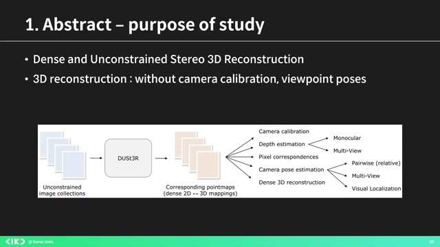
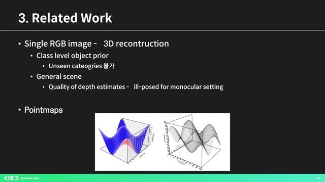
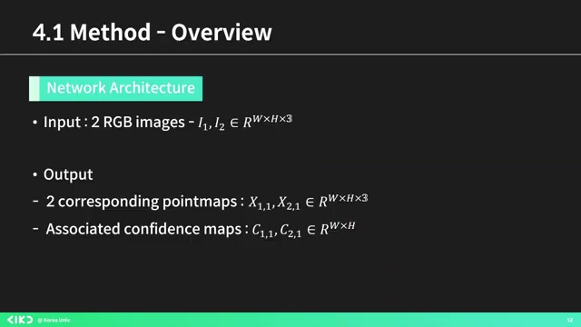
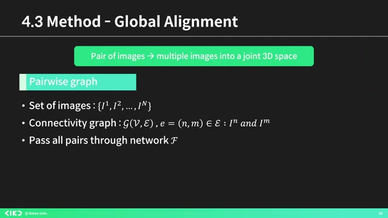
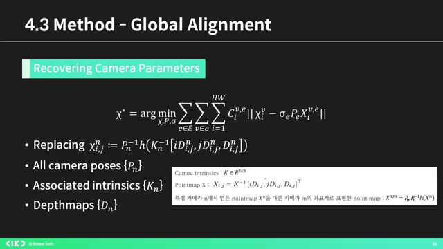
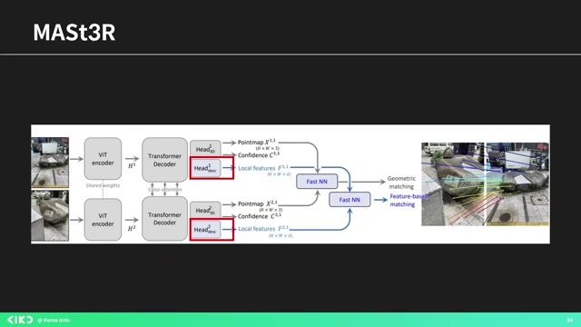

# AIKU 24-2 세미나 5회 이미지 매칭 로컬 특징과 그 너머(DUSt3R)

흥미로운 내용 3가지 :

- **DUSt3R** 모델은 카메라 칼리브레이션이나 뷰포인트 정보 없이 3D 재구성 가능
- **3D 리컨스트럭션**을 위해 포인트 맵 생성과 카메라 파라미터 최적화 필요
- **DUST3R** 모델은 카메라 정보 없이도 상대적으로 정확한 3D 리컨스트럭션 가능

이 영상은 이미지 매칭 및 3D 재구성을 위한 최신 모델인 'DUSt3R'에 대한 심도 깊은 세미나 발표입니다. 발표자는 크로코 모델과의 연관성을 통해 더스터의 논문 내용을 상세히 설명하고, 다양한 이미지 처리 기법과 3D 포인트 맵의 생성 방법을 다룹니다. 또한, 마스터 모델이 더스터의 성능을 개선하는 방법과 함께 연구 결과를 공유하며, 실제 실험에서의 성과를 통해 3D 리컨스트럭션의 중요성을 강조합니다. 이 영상을 통해 이미지 매칭 및 3D 기술에 대한 이해를 높이고, 최신 연구 동향을 파악할 수 있습니다.

## 핵심주제

세 가지 주요 **논문**이 이미지 매칭의 발전에 기여하고 있다.

- **크로코** 모델은 3D 이미지 생성의 기초를 다지며, **더스터**는 그 성능을 향상시켜준다.

- 마스터 논문은 더스터를 기반으로 **정확도를 높이기 위해** 새로운 헤드를 추가하는 연구이다.

3D 포인트 맵 및 카메라 **파라미터** 최적화 방법이 강조되고 있다.

- MVS 퀄리티와 **촬영 기법**은 카메라 파라미터의 정확도에 크게 의존한다.

- 키포인트 매칭을 이용한 **SFM** 기법이 사용되지만, 노이즈에 취약하다는 단점도 있다.

포인트 맵은 3D 데이터의 **핵심**로 사용된다.

- 포인트 맵은 개별 3D 점의 좌표를 나타내며, **RGB 이미지**의 해상도에 따라 구성된다.

- 이 과정을 통해 **그라운드 트루스 포인트 맵**이 생성된다.

글로벌 **얼라이먼트**가 다양한 이미지 최적화를 가능하게 한다.

- 주어진 이미지 집합에서 다양한 텍스처가 생성되어 비주얼 콘텐츠가 공유된다.

- 이 과정에서 **포즈와 스케일링** 변수를 이용한 최적화 식이 적용된다.

DUST3R 모델이 3D **리컨스트럭션** 결과를 제공합니다.

- 이 모델은 카메라 정보 없이도 의미 있는 결과를 도출하며, 평균 오류가 2.7mm에 불과하다.

- 프리 트레이닝과 고해상도가 출력 성능에 중요한 역할을 한다.

## 타임라인

### 1. 📷 이미지 매칭 로컬 피처 및 Beyond

- 발표자는 **DUSt3R** 모델에 대한 논문을 중심으로 세미나를 진행함.

- 네이버 랩스 유럽에서 발표한 세 가지 논문 중 하나로, 크로코(CRoKo), 더스터(DUSt3R), 마스터(MASTER)가 포함됨.

- 첫 번째 논문 **크로코**는 셀프 슈퍼바이즈드 프리트레이닝 모델을 3차원에 적용한 것임.

- 크로코 모델은 두 개의 입력 이미지를 인코딩하고, 디코더를 통해 첫 번째 이미지의 마스킹된 부분을 재구성함.

- **더스터(DUSt3R)**는 크로코 모델의 디코더를 추가로 활용하여 카메라 칼리브레이션이나 뷰포인트 포즈 정보 없이 작동하는 모델로, "D and Unst Stereo 3D Reconstruction"의 약자임.

### 2. 3D 포인트 맵 생성 및 카메라 파라미터 최적화 방법

- 두 장 이상의 이미지 제공 시, 모든 포인트 맵을 공통 기준 프레임으로 표현하는 방법을 제시하였다.

- 다양한 3D 태스크가 논문을 통해 설명되며, 3D 리컨스트럭션은 3D 지오메트리와 카메라 파라미터 예측이 목표다.

- 특히 MVS 퀄리티는 입력 이미지와 카메라 파라미터의 품질에 의존하며, 고된 카메라를 통해 3D 포인트 맵을 도출하는 것이 이 논문의 핵심이다.

- 카메라 파라미터는 렌즈와 센서 위치로 결정되며, 이미지 패널의 이동과 확대, 기울기를 알려준다.

- SFM은 키포인트 매칭을 통해 픽셀 덤프를 얻은 후, 'Bundle Adjustment'로 3D 좌표와 카메라 파라미터를 최적화하지만 노이즈에 취약한 단점이 있다.

- 멀티뷰 스테레오 방법은 두 개 이상의 뷰포인트에서 삼각 측량으로 3D 재구성하며, 정밀한 카메라 칼리브레이션에 의존하는 문제가 있다.

### 3. 3D 데이터 표현을 위한 포인트 맵 설명

- 레이드 웍스는 **포인트 맵**으로 3D 데이터를 표현하며, 이는 개별 3D 점의 좌표를 나타낸다.

- 포인트 맵은 너비 W와 높이 H를 가지며, RGB 이미지의 해상도에 기반한 3차원 배열로 구성된다.

- 카메라의 트랜스포메이션은 R3로 이루어지며, 특정 카메라에서 얻은 포인트 Xn은 다른 카메라의 좌표계로 변환된다.

- 논문에서는 이러한 과정을 통해 **그라운드 트루스 포인트 맵**을 생성했다고 한다.

### 4. 논문 아키텍처와 3D 리그레션 로스 설명

- 이 논문은 입력으로 두 개의 **RGB 이미지**를 받아, 두 개의 **포인트 맵**과 **컨피던스 맵**을 출력하는 아키텍처를 설명합니다.

- 크로코 사전 학습의 이점을 활용해 네트워크를 프리트레이닝하여, 초기 가중치로 로코를 사용해 더 나은 성능을 발휘하도록 합니다.

- 이 네트워크는 **동일한 브랜치**로 구성되며, ViT 인코더는 입력 이미지를 인코딩하고, 디코더는 셀프 어텐션, 크로스 어텐션, MLP로 이루어져 있습니다.

- 최종적으로 각 브랜치에서 **리그레션 헤드**를 통과해 포인트 맵과 컨피던스 맵을 출력하며, 3D 리그레션 로스는 유클리드 거리로 정의됩니다.

- 마지막으로 모델 훈련 결과를 보여주며, RGB 인풋 이미지, 스맵, 컨피던스 맵, 그리고 3D 컨스트럭션이 잘 작동한다고 보고합니다.

### 5. 글로벌 얼라이먼트를 통한 이미지 최적화 설명

- 앞서 설명한 네트워크는 두 개의 이미지에 대해서만 작동하며, 글로벌 얼라이먼트는 **다양한 이미지 결합** 방법에 대한 설명이다.

- 우선 주어진 이미지 집합에서 개가게 이미지를 바탕으로 텍스를 형성하고, 이를 엣지를 통해 비주얼 콘텐츠를 공유하는 그래프를 만든다.

- 그 후 모든 쌍에 대해 앞서 언급한 네트워크를 통과시키며, 글로벌 옵티마이제이션 부분에서는 모든 페어와이즈 예측을 **공통 사용자 계로 정렬**한다.

- 이를 위해 포즈와 스케일링 변수를 이용하여 최종 로스를 식으로 표현하며, 이 식을 통해 카메라 사진의 카메라 파라미터를 구할 수 있다.

- 마지막으로, 이 공식은 앞에서 설명한 포인트 맵으로 변환하는 방법을 제시하며, 이를 통해 카메라 포즈와 인트로 스맵, 최적을 각각 구할 수 있다.

### 6. DUST3R 3D 리컨스트럭션 실험 결과

- 세 가지 요소를 모두 추정할 수 있는데, DUST3R 모델은 베스트 어시스를 달성하지 못했으나, 카메라 파라미터 없이도 **상대적으로** 유용한 결과를 보여주었다.

- 에버리지 오류는 2.7mm, 컴플리트 오류는 0.88mm로, 카메라 정보 없이도 의미 있는 결과를 도출했다고 한다.

- 크로코 영향을 사용했을 때 결과가 더 좋았으며, 프리 트레이닝과 하이 레솔루션이 중요한 역할을 한다.

- DUST3R 3D 리컨스트럭션 프레임워크와 관련된 마스터 논문에서는 **정확도를 보완하기 위해** 새로운 헤드를 추가하여 로컬 피처를 학습시킨다고 설명된다.

- 각 네트워크는 입력 이미지를 기반으로 3D 포인트 컨피던스와 로컬 피처를 예측하며, 기하 및 피처 기반 매칭을 수행한다.

### 7. 3D 지오메트리 및 카메라 보정 발표

- 결과를 보면, 이 그림은 마스터의 던스를 보여주고 있으며, 카메라가 극단적이어서 시각적으로 유사한 점이 거의 없다.

- 하지만 잘 칭찬하는 요소들이 있다는 것을 보여주고 있다.

- 예측된 3D 지오메트리는 초점 거리 도출, 카메라 보정, 카메라 포즈 추정에 유용하게 사용된다.

- 이 발표를 마치겠습니다. 감사합니다.

