# AI in Semiconductor Manufacturing

흥미로운 내용 3가지 :

- 제조업에서 인공지능(AI)의 수요가 급증 중이며, 2023년부터 2028년까지 연간 46.5% 성장이 전망된다.
- 인공지능은 분석 작업, 실시간 의사 결정 지원, 자동화 등 다양한 방면에서 제조업에 적용될 수 있다.
- 인공지능을 적용하기 위해서는 데이터 품질과 보안, 컴퓨팅 리소스, 전문 인력 등의 어려움을 극복해야 한다.

이 세미나는 반도체 제조업에 인공지능(AI)을 적용하는 다양한 방법론을 탐구합니다. AI의 발전과 제조업에서의 수요 증가가 뒷받침되어, 효율성 향상 및 비용 절감의 기대효과를 주장합니다. 특히 반도체 제조공정에서의 AI 활용 사례를 통해 품질 개선, 공정 최적화, 설비 예지 보전 등을 구체적으로 살펴봅니다. 이 영상은 인공지능이 반도체 산업에서의 혁신을 이끌어내는 핵심 역할을 한다는 주제를 관통하고 있습니다.

## 핵심주제

제조업에서 **AI**의 적용은 빠르게 성장하고 있으며, 반도체 산업에서 특히 두드러진다.

- **AI** 기술은 2023년 32억 달러 시장에서 2028년 208억 달러로 급성장할 것으로 예측된다.

- 제조업 내에서 자동차, 제약, **반도체** 분야에 걸쳐 **AI**의 필요성이 증가하고 있다.

- 이번 세미나에서는 **반도체 제조공정**에 특화된 다양한 **AI** 적용 사례가 공유될 예정이다.

반도체 제조에서 **데이터 품질**과 보안 문제는 **AI** 적용의 큰 장애물이다.

- 고품질의 **데이터** 확보는 **AI**의 성능을 좌우하는 핵심 요소로, 이를 위해서는 많은 비용이 필요하다.

- 또한, **컴퓨팅 리소스**의 요구도 증가하며, 전문 인력을 보유한 기업만이 **AI** 기술을 효과적으로 활용할 수 있다.

- 이러한 문제들은 세미나에서 다루어질 주요 주제 중 하나이다.

반도체 제조 공정의 **최적화**는 **AI**와 함께 이루어져야 한다.

- 공정의 각 단계에서 발생하는 **부작용**을 효율적으로 제어하는 것이 **AI** 활용의 중요성이다.

- 최적화된 생산 효율과 품질 향상을 위해 정량적 분석 및 매개변수 튜닝이 필요하다.

- 이에 대한 연구와 사례는 세미나에서 중점적으로 다루어질 예정이다.

설비의 **예지 보전** 및 스케줄링은 **AI**를 통한 효율성이 매우 높다.

- **설비 센서** 데이터를 통해 고장을 예측하고 사전 조치를 취하는 연구가 활발히 진행 중이다.

- 2024년에 발표된 논문들은 **스케줄링** 최적화와 관련된 새로운 기법을 제안하고 있다.

- 이러한 연구들은 생산라인의 효율성을 크게 향상시킬 수 있는 가능성을 보여준다.

부품의 **잔존 수명 예측**은 생산 품질을 보장하는 데 중요한 역할을 한다.

- 불량 원인을 정확히 분석하고, **상태 모니터링** 데이터를 통해 예측 모델을 개발하는 연구가 이루어지고 있다.

- 잔존 수명이 급격히 감소하는 패턴을 미리 확인함으로써, 품질 저하를 방지할 수 있는 방법론이 필요하다.

- 이러한 모델은 다양한 센서를 통해 수집된 데이터를 기반으로 작동한다.

## 타임라인
### 1. 🛠 반도체 제조업에서의 인공지능 적용

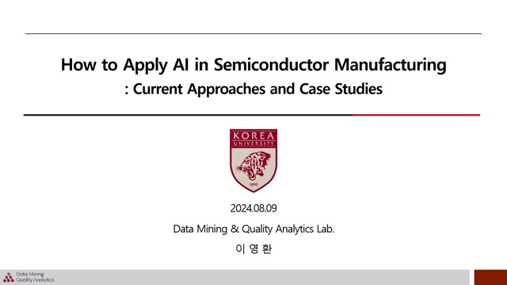
- 발표자는 이영이며, 고려대학교 산업공학과 DMK 연구실에서 석사 과정을 밟고 있다.

- 제조업에서 인공지능(AI)의 수요가 증가하고 있으며, 2023년 32억 달러에서 2028년 208억 달러로 연간 46.5% 성장할 것으로 전망된다.

- 인공지능은 제조업에서 분석적 작업, 실시간 의사 결정 지원, 자동화 단계로 활용될 수 있다.

- 분석적 작업에서는 데이터를 수집, 분석하여 현재 상황을 파악하고 미래를 예측한다.

- 실시간 의사 결정 지원은 분석과 미래 예측을 기반으로 공정을 최적화하고 품질을 개선한다.

- 자동화 단계에서는 생산 라인이 자동화되고, 피드백 루프를 통해 지속적 개선이 이루어진다.

- 현재 제조업에서 인공지능의 활용은 초기 단계에 있으며, 다양한 제한 사항들이 개선되어야 한다.

### 2. 제조업 인공지능 적용의 어려움과 반도체 공정

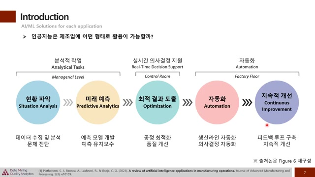
- 제조업에 인공지능을 적용할 때의 주요 어려움은 데이터 품질과 보안입니다.

- 인공지능의 성능은 **고품질 데이터**에 의존하기 때문에, 실시간 데이터 확보가 중요하지만, 노이즈를 제거하고 정답 데이터를 생성하는 데 비용이 발생합니다.

- 또한 고비용의 **컴퓨팅 리소스**와 에너지가 필요하며, 인공지능을 적절하게 구현하기 위한 전문 인력이 필요합니다.

- 이번 세미나에서는 반도체 제조공정을 중점적으로 다룰 것이며, ASMC 2022년에 발표된 연구 주제를 분석하여 일곱 가지 카테고리로 분류할 예정입니다.

- 그리고 반도체 제조 공정에 대해 알아보면, 웨이퍼를 이용해 반도체 소자를 구현하는 과정을 다루며, 품질 관리를 위한 계측 및 검사 단계를 포함합니다.

### 3. ️📊반도체 제조 공정의 최적화와 연구

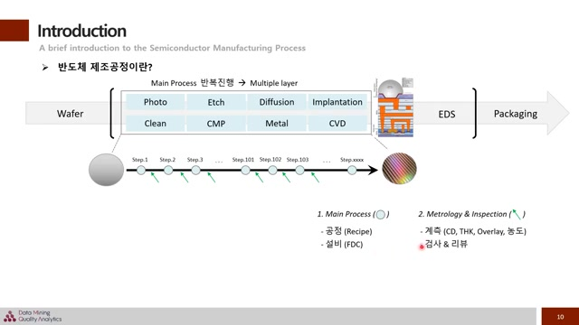
- 데이터는 주로 분석에 활용되며, 메인 프로세스는 여러 대의 설비가 존재하는 점을 이해하는 것이 중요하다.

- 각 설비는 여러 개의 **챔버 유닛**으로 나뉘며, 이들의 작동 방식 또한 중요한 포인트이다.

- 반도체 제조 공정 관련 세미나 자료는 홈페이지에 공개되어 있어, 관심 있는 분들은 참고하면 더욱 깊이 이해할 수 있다.

- 첫 번째 카테고리인 **공정 최적화**는 매개 변수를 분석하고 최적화하여 생산 효율과 제품 품질을 향상시키는 것이 목적이다.

- CMP(Chemical Mechanical Polishing) 공정은 웨이퍼 표면을 갈아내는 과정으로, 이 과정에서 발생할 수 있는 부작용을 정교하게 제어해야 한다.

### 4. AI를 활용한 공정 최적화 방법론 소개

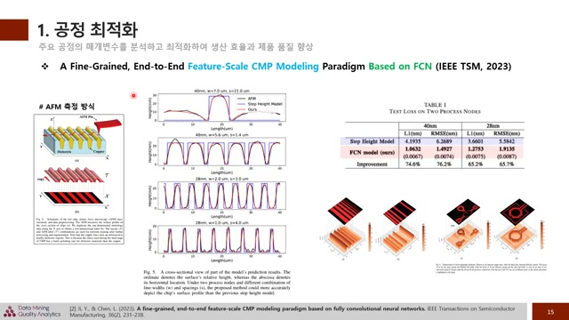
- 학습 데이터 구성 시, AFM 장비를 통해 표면 프로파일을 측정했으며, 모델 예측 결과가 기존 방법론보다 **정확하게** 나타났음을 알 수 있다.

- 결과적으로 40나노, 28나노 공정에서 테스트 손실이 낮아지는 것을 확인하였으며, IC 설계에서도 이 방법론이 **효과적**임을 보여주었다.

- 두 번째 논문인 머신러닝 B meur에서는 애치 공정을 다루며, 공정 후 길이 측정의 **정확도** 문제를 해결하기 위해 머신러닝 기법을 도입했다.

- 웨이퍼 표면을 광학적으로 측정하고, 수치 변환 후 학습된 모델을 사용하여 탑 CD, 바텀 CD, 트렌치 앱스의 예측치를 제공함으로써 공정 최적화에 기여하였다.

### 5. 설비 예지 보전 및 스케줄링 연구 개요

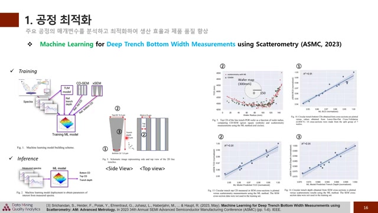
- 설비 예지 보전은 **설비 센서** 데이터를 통해 주요 인자의 거동이나 고장을 예측하고, **사전 조치를** 통해 가동 중단 손실을 최소화하는 분야이다.

- 2023년에 발표된 'TVB Variation Based Generative Models for Highly Imbalanced' 논문은 FD 데이터의 불균형 문제를 해결하기 위해 VA 기반의 생성 모델을 적용한 케이스를 다룬다.

- 이 논문에서는 데이터 증강 기법을 통해 **분류 성능**을 향상시키는 연구를 진행하였고, 인디비주얼 스트레지가가 더 성능이 높았음을 밝혔다.

- 설비 스케줄링 분야에서는 각 설비의 가동 일정을 최적화하여 생산 라인의 효율성을 높이고 품질 하락을 방지하는 연구가 이루어지고 있다.

- 2024년에 발표된 'Practical Reinforcement Learning for Adaptive Scheduling in Manufacturing' 논문은 **반도체 제조** 공정에서 포토 리소그래피가 중요한 병목 현상임을 설명한다.

### 6. ️📊웨이퍼 제조 공정의 스케줄링 최적화 방법

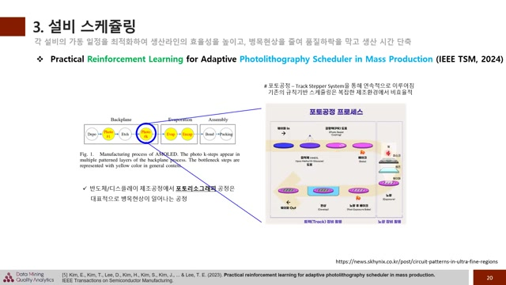
- 웨이퍼의 공정 단계에서는 마스크 세팅 후 노광 작업 및 구워진 후 현상 과정을 거친다.

- 각 과정은 역할에 따라 분리되어 있으며, 비슷한 기능을 가진 유닛이 여러 개 사용되는 점이 중요하다.

- 이 논문은 마스크 사용 관점에서 발생하는 병목 현상을 해결하기 위한 방법을 제안하며, 기존의 규칙 기반 스케줄링 방법의 한계를 언급한다.

- 강화학습 기반의 스케줄링 최적화 방법을 통해 DQN 알고리즘으로 최적의 정책을 학습하고, 실험을 통해 성과를 보여주었다.

- 결과적으로 강화학습 기반 방법이 기존 규칙 기반 방법보다 우수한 성능을 보이며, 복잡한 환경에서의 포토리소그래피 스케줄링 최적화를 제시한다.

### 7. 반도체 설비의 챔버 유닛 이동 최적화 필요성

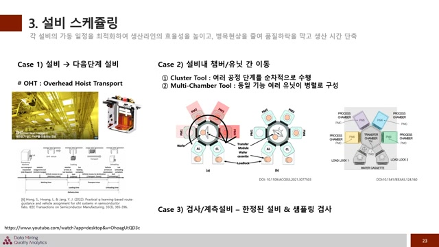
- 관련 논문을 추가했으니, 관심 있는 분들은 참고해 주시기 바랍니다.

- 반도체 설비는 최소 한 대의 장비로 구성되지 않고, 대부분 **챔버 유닛**이라 불리는 하위 개념들로 이루어져 있으며, 이는 설비 종류나 메이커에 따라 이름이 다르다.

- 두 가지 주요 타입이 있으며, 첫 번째는 여러 공정 단계를 순차적으로 진행하는 **클러스터 툴**이고, 두 번째는 병렬적으로 구성된 **멀티 챔버 툴**이다.

- 반도체 공정은 화학 물질을 사용하고 매우 미세한 단위로 컨트롤해야 하기에 반응 시간이 중요하며, 충분한 반응 시간 없이 다음 공정이 진행되면 문제가 발생할 수 있다.

- 따라서 이러한 상황을 방지하기 위해서 **최적화된 스케줄링**이 필수적이다.

- 또한 검사 계측 설비에 대한 경우는 품질 모니터링을 위해 필요한 개선 사항으로, 모든 웨이퍼가 검사되지 않으며 샘플링을 통해 품질 리스크를 최소화해야 한다.

### 8. 부품 잔존 수명 예측을 위한 새로운 모델

- 부품의 잔존 수명을 예측하여 유지보수 시기를 미리 파악하고 품질 저하를 방지하는 분야에 대한 논의입니다.

- 이온 밀링 공정에서 잔존 수명 예측을 위해 멀티스케일 워크를 사용한 '멀티스케일 & MBR Transform Network for Remaining Useful Life Prediction' 논문이 2024년에 발표되었습니다.

- 이 연구는 이온 밀링 에칭 공정의 복잡한 상호작용을 다루며, 분포의 불균형으로 인한 예측 어려움을 극복하기 위한 방법을 제안합니다.

- 다양한 센서에서 수집된 상태 모니터링 데이터를 활용하고, 원형 컨볼루션을 통해 멀티스케일 피처를 추출하여 예측 모델에 입력합니다.

- 실험 결과, 제안된 방법론이 다른 방법들보다 정답 데이터에 더 근접한 예측 성능을 보여주었습니다.

### 9. 반도체 제조에서 고장 예측과 품질 분석의 중요성

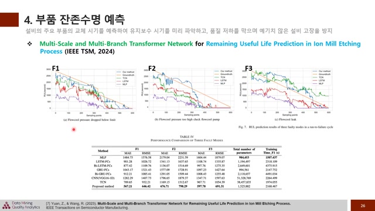
- 고장 발생 직전에 잔존 수명이 급격히 감소하는 패턴이 실제 데이터와 유사하며, 제안된 방법론의 롤스가 가장 낮기 때문에, 부품의 잔존 수명 예측이 중요하다.

- 이 모델은 각 설비의 케이스에 쉽게 적용되고 최적화될 수 있도록 설계되어야 하며, 반도체 제조 공정에서 동일한 메이커의 설비가 다르게 작동하는 사례들이 많음을 고려해야 한다.

- 불량 원인을 찾아내고 생산 수요를 예측하여 수율 향상을 위한 개선 방안을 도출하는 공통성 분석이 필요하며, 이는 웨이퍼의 진행 이력을 기반으로 특이한 불량 패턴을 찾는 과정이다.

- 모든 웨이퍼가 모든 스텝에서 검사되지 않기 때문에 불균형한 데이터 상황에서 커널리 분석이 어려움을 설정하였고, 이를 해결하기 위한 알고리즘을 제안하였다.

- 이 알고리즘은 적절한 스텝에서 분량을 모니터링하는 데 초점을 맞추며, 이를 통해 더 효과적인 검사 방법을 제시한다.

### 10. 웨이퍼의 불량 현상 분석 및 연구 기반

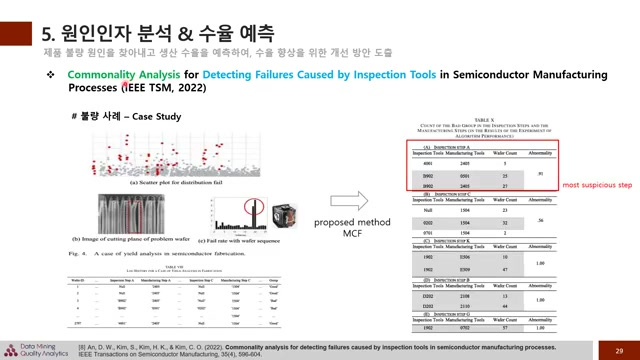
- 왼쪽에 소자가 휘어진 분량이 발생했으며, 이는 특정 웨이퍼 위치에서는 강하게 나타나는 특징이 있습니다.

- 웨이퍼는 정해진 자리에 담겨 이동하며, 특정 위치에서 이상이 발생했다고 표현하고, 이러한 불량 현상은 중요한 인자가 될 수 있습니다.

- 논문에서는 자재에서 추출한 데이터를 통해 MCF 기반으로 널리티 분석을 수행하였고, A 검사 단계가 근본 원인으로 의심된다고 주장합니다.

- 웨이퍼 맵은 불량 발생 패턴을 시각화하여 개선 인사이트를 발굴할 수 있는 중요한 데이터이며, 공개된 데이터셋 덕분에 연구가 활발하게 진행되고 있습니다.

- 연구들은 특이 패턴 분류에 중점을 두고 있으며, 세미 셀프 슈퍼바이즈드 러닝 기반으로 데이터 증강 기법을 적용하여 성능을 향상시키고 있습니다.

### 11. 웨이퍼 맵 분류를 위한 반도체 검사 연구

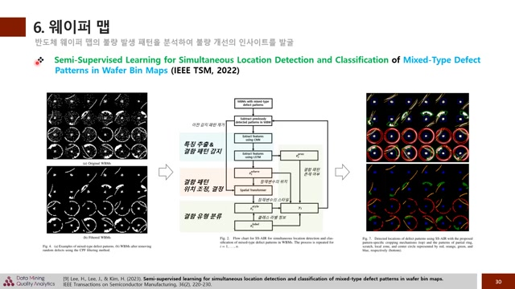
- 최근에는 위치 정보 제공과 세그멘테이션이 가능한 모델들을 연구하여 **더 많은 정보**를 획득하려고 하고 있습니다.

- 논문 제목은 'Semi-Supervised Method for Anomaly Detection and Classification of Mixed-Type Patterns in Wafer Maps'로, 2022년 APLITSM에서 발표된 연구입니다.

- 이 연구는 세미 슈퍼바이즈드 상황을 가정하고 **믹스드 타입**을 다루면서도 클래스 분류를 처리합니다.

- 웨이퍼 데이터를 필터링하여 입력값을 만든 후, CNN과 LSTM을 사용해 결함 패턴의 특징을 추출합니다.

- 결함 위치를 정확하게 파악하고, 각 패턴의 스타일에 따라 결함을 분류하며, 검토 및 분류 과정에서 딥러닝과 함께 계산적 및 물리적 모델들이 활용되고 있습니다.

### 12. 웨이퍼 검사 과정 및 논문 소개

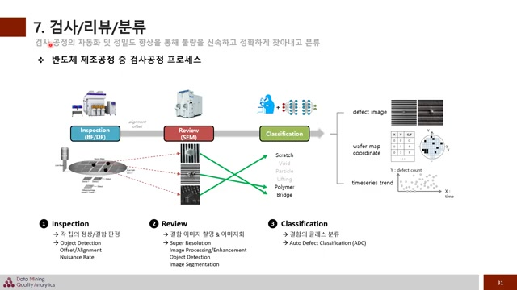
- 웨이퍼 표면의 불량을 찾는 검사 단계, 불량 이미지를 촬영하는 리뷰 단계, 그리고 클래스 분류가 이루어지는 분류 단계로 구성된다.

- 검사된 데이터는 불량 이미지 좌표와 웨이퍼 맵 시계열 데이터 형태로 변환되어 불량 관리 및 분석에 활용된다.

- 각 단계에서 다양한 인공지능 기술이 사용되며, 검사 단계에서는 오브젝 디텍션 기술과 오프셋 얼라인먼트 방법론이 적용된다.

- 리뷰 단계에서는 딥러닝을 통해 이미지 화질을 높이고, 분류 단계에서는 자동화된 클래스 분류가 연구되고 있다.

- 'PR Par Alignment for DI to Database Inspection based on the Generative Adversarial Network'라는 논문은 GAN을 이용한 D2DB 검사 방식을 다루고 있다.

### 13. 레아웃과 얼라인먼트 개선을 위한 인공지능 적용

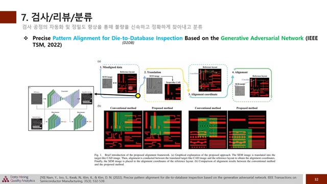
- 레이아웃과 얼라인먼트를 단순히 시도하면 잘 맞지 않기 때문에, 레이아웃 럼 캐드 이미지 형태로 변환하는 과정이 필요하다.

- 이 과정에서 **겐**을 사용하여 타겟과 유사한 캐드 형태의 이미지로 변환하고, 이후 레이아웃과 얼라인먼트를 맞추면 훨씬 수월해진다.

- 기존 방법과 비교할 때, 잘 맞지 않던 이미지들이 더 효과적으로 매칭될 수 있다.

- 웨이퍼 검사에서도 다양한 방법이 활용되며, 업계에서는 인공지능을 통한 발전 가능성이 무궁무진하다.

- 오늘 세미나에서는 반도체 제조 분야의 인공지능 적용 사례를 살펴보았고, 문제 해결을 위한 **도메인 지식**의 중요성도 강조했다.

