# AIKU 24-2 DeepIntoDeep 9회 딥러닝 입문하기 - Object Detection

흥미로운 내용 3가지 :

- 오브젝트 디텍션은 물체의 종류, 위치, 그리고 자신감까지 출력한다.
- 투 스테이지와 싱글 스테이지는 오브젝트 디텍션의 두 가지 주요 접근 방식이다.
- 바운딩 박스를 표현하는데 IoU와 NMS 등의 개념을 활용하여 모델의 성능을 향상시킬 수 있다.

이 영상에서는 오브젝트 디텍션의 기본 개념과 다양한 접근 방식인 투 스테이지 및 싱글 스테이지 모델을 설명합니다. 강의는 초보자도 이해할 수 있도록 친절하게 구성되어 있으며, 딥러닝을 활용한 오브젝트 디텍션에서 CNN과 트랜스포머 모델의 사용을 중심으로 진행됩니다. 특히, 성능과 속도의 균형을 맞추기 위한 다양한 방법론이 소개되어 '오브젝트 디텍션'의 이해를 돕습니다.

## 핵심주제

오브젝트 디텍션은 **로컬라이제이션**과 **분류**의 두 가지 주요 문제로 구성된다.

- 오브젝트 디텍션은 입력된 이미지에서 물체의 종류를 알아내고 위치를 예측하는 과정이다.

- 로컬라이제이션은 개체의 위치를 추정하고, 분류는 그 물체가 무엇인지 식별하는 것을 목표로 한다.

- 이 두 가지 작업을 통해 디지털 이미지 속 정보를 효과적으로 분석할 수 있다.

딥러닝 기반의 모델인 **CNN**과 **트랜스포머**는 오브젝트 디텍션에 널리 사용된다.

- CNN은 이미지를 두 단계로 처리하여 물체의 위치를 추출하고, 각 위치의 물체를 분류한다.

- 트랜스포머는 이미지와 피처를 입력으로 받아 더 높은 효율성을 제공하며, CNN과 결합되어 효과적인 모델을 형성한다.

- 이 두 기술의 결합은 성능 저하 없이 계산량을 줄이는 데 기여한다.

프리시전과 리콜은 오브젝트 디텍션의 **성능 평가**에 필수적이다.

- 프리시전은 정확한 예측의 비율을 나타내고, 리콜은 실제 정답 중 올바르게 예측한 비율을 나타낸다.

- 이 두 지표의 관계는 모델의 성능을 평가하고 튜닝하는 데 중요한 역할을 한다.

- 이상적인 상황에서는 평균 정밀도를 통해 총 성능을 나타내며, 이를 통해 다양한 클래스로 구분된 정보를 비교할 수 있다.

**YOLO** 및 **DETR** 같은 모델들은 기존 방법보다 더 간단하게 오브젝트 디텍션을 수행한다.

- YOLO는 이미지를 격자로 나누어 빠른 속도로 바운딩 박스를 예측할 수 있는 장점이 있다.

- DETR은 기존의 바운딩 박스 설정 과정을 생략하여 효율적인 디텍션을 가능하게 한다.

- 이러한 모델들은 복잡한 과정을 단순화하여 더 빠른 결과를 제공하고, 실시간 처리의 한계를 보완한다.

중복 제거(NMS)는 **바운딩 박스 예측**의 정확성을 높이는 중요한 기법이다.

- NMS는 예측된 바운딩 박스 중 중복된 것을 제거하여 최종 결과를 정제하는 역할을 한다.

- 이를 통해 더욱 깔끔한 결과를 얻고, 모델의 성능을 향상시키는 데 기여할 수 있다.

- 중복 제거가 없다면, 모델이 동일한 물체를 여러 번 예측하여 혼란을 초래할 수 있기 때문에 필수적이다.

## 타임라인

### 1. 🤖 오브젝트 디텍션 개요

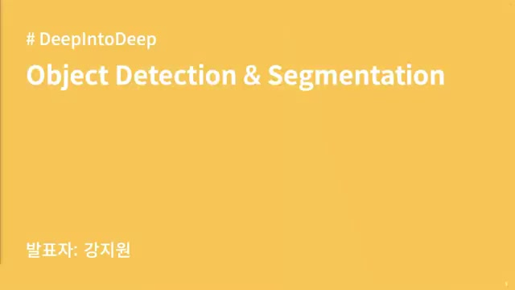
- **오브젝트 디텍션**이란, 주어진 이미지에서 **물체의 위치**와 **종류**를 예측하는 작업이다.

- **디텍션**은 로컬라이제이션(물체의 위치 추정)과 분류(물체가 무엇인지 판별) 두 가지 태스크로 구성된다.

- **투 스테이지**와 **싱글 스테이지** 모델 두 가지 계열로 나뉜다.

- 주로 **CNN**과 **트랜스포머** 모델을 사용하여 오브젝트 디텍션을 수행한다.

- 최근에는 **트랜스포머** 모델이 많이 사용되지만, 트랜스포머 디텍션 모델의 기반은 여전히 **CNN** 모델이다.

### 2. 🖼️오브젝트 디텍션의 기본 개념과 접근 방식

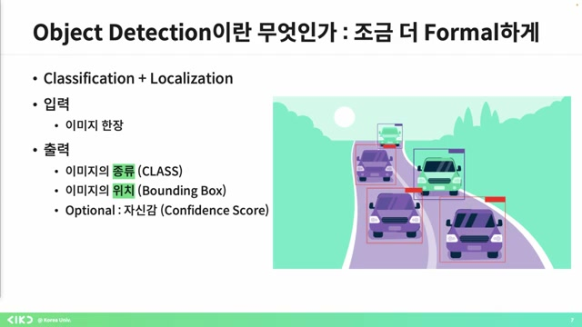
- 오브젝트 디텍션에서는 물체의 종류, 위치, 그리고 예측값에 대한 **자신감**까지 출력한다.

- 하지만 이미지마다 물체의 개수와 순서가 다르기 때문에 단순하게 CNN 출력으로 해결하기 힘들다.

- 이러한 문제를 해결하기 위한 접근 방식으로는 두 가지가 있으며, 하나는 **투 스테이지** 방식이고 다른 하나는 **원 스테이지** 방식이다.

- 투 스테이지는 물체의 위치를 먼저 추출한 후 물체의 종류를 알아내고, 원 스테이지는 한 번에 모든 정보를 제공하는 방식이다.

- 이 영상에서는 유명한 모델들을 통해 하이 레벨의 문제점과 발전 과정을 다룰 예정이다.

### 3. 바운딩 박스와 IoU, NMS 개념 설명

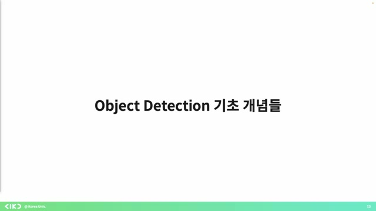
- 바운딩 박스를 표현하기 위해 **좌표 네 개**를 사용한다.

- IoU(Intersection over Union) 개념을 통해 바운딩 박스의 정확성을 평가하며, GT 바운딩 박스에 가까울수록 IoU가 높아진다.

- 모델이 여러 개의 바운딩 박스를 예측할 때, 중복된 박스를 **하나로 합치는** 기법이 non-maximum suppression(NMS)이다.

- 예측된 바운딩 박스와 GT 바운딩 박스를 매칭하며, IoU가 0.5보다 높으면 매칭된 것으로 판단하고 학습을 진행한다.

- 0.5라는 값은 절대적이지 않으며, 상황에 따라 변할 수 있다.

### 4. 프리시전과 리콜의 기본 개념 및 정의

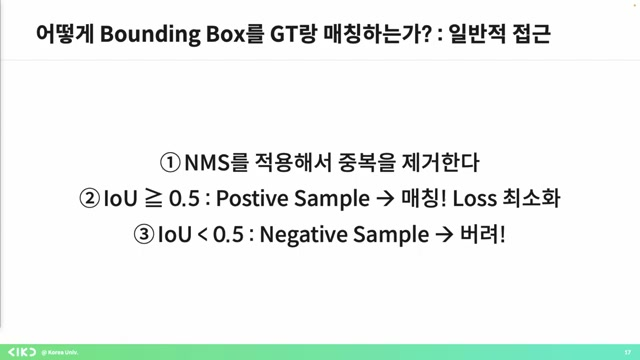
- 프리시전은 모델이 정답을 예측한 샘플 중 실제 정답인 샘플의 비율이며, 리콜은 실제 정답 중 모델이 정답이라고 예측한 비율이다.

- 프리시전과 리콜은 반비례 관계로, 쓰레시 홀드를 낮게 잡으면 리콜은 올라가고 프리시전은 내려가며, 높게 잡으면 반대로 리콜은 내려가고 프리시전은 올라간다.

- 이상적인 경우에는 평균 정밀도(average precision, AP)를 통해 모델의 성능을 평가하며, 클래스별 AP 평균을 내어 mAP(Mean Average Precision)으로 나타낸다.

- 이 개념들은 오브젝트 디텍션을 이해하기 위해 필수적이며, 질문이 있을 경우 언제든지 질문하면 된다.

### 5. ️🧠딥러닝의 시작, CNN과 객체 탐지

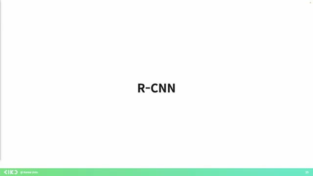
- 태초에 **ICNN**이 있었고, 이는 딥러닝으로 객체 탐지를 시도한 최초의 모델이다.

- 이 모델은 이미지를 두 단계로 처리하여, 가능한 위치를 추출한 후 그 위에서 각 프로포저를 통해 분류를 수행한다.

- 딥러닝 이전에도 컴퓨터 비전 알고리즘이 있었으며, 이때는 사용 가능한 위치를 먼저 추출하고 CNN으로 인식시키는 방식을 사용했다.

- CNN 피처를 활용해 분류를 할 때, ML 대신 **서포트 벡터 머신**과 선형 회기를 사용하여 더 나은 성능을 보였고, 데이터와 하드웨어가 부족한 상황에서도 효과적이었다.

- CNN 피처는 이미지의 공간적 특성을 잘 유지하며, 리셉티브 필드의 정보를 전달한다는 점에서 전통적인 머신러닝 방법도 여전히 유효하다는 것을 강조하고 싶었다.

### 6. CNN 피처와 RCNN 구조에 대한 설명

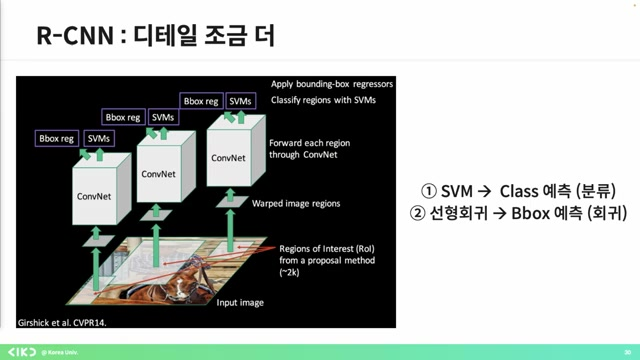
- CNN 피처는 인풋 이미지 정보를 **효율적으로 압축**하여 다양한 작업에서 잘 사용될 수 있다.

- RCNN 구조에서는 인풋 이미지가 들어가면 셀렉티브 설치 제안이 이루어지며, 이 과정에서 2000개의 CNN 피처를 추출하여 각각 클래스와 바운딩 박스를 예측한다.

- 딥러닝 기반의 오브젝트 디텍션은 기존의 컴퓨터 비전 방법론보다 더 효과적으로 작동하지만, CNN 학습, 서포트 벡터 머신 및 선형 회귀를 따로 학습해야 하기 때문에 학습 과정이 **어렵고 복잡**하다.

- 이로 인해 연산량이 많아지며, 속도의 병목 현상이 발생한다.

- 따라서 패스트 RCNN은 이 문제를 해결하기 위해 CNN 계산을 한 번으로 줄이는 방식으로 개선되었다.

### 7. CNN을 이용한 이미지 처리 구조 이해하기

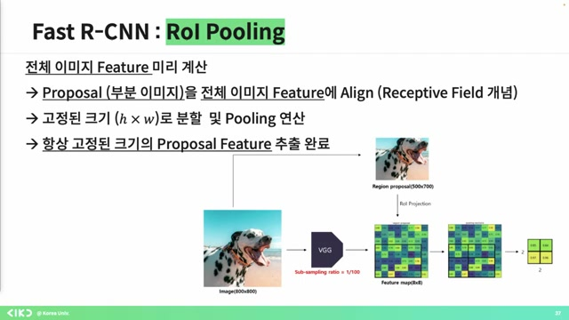
- 현재 8 * 8의 피처 맵을 기반으로 전체 이미지의 피처를 미리 계산하며, CNN을 사용하여 해당 영역을 이미지에 표시할 수 있다.

- 이러한 과정은 CNN이 **공간적인 정보**를 유지하기 때문에 가능하며, 이를 통해 고정된 크기의 피처 맵을 생성할 수 있다.

- RCNN 구조에서는 이미지 인풋이 주어지면 셀렉티브 서치를 통해 피처를 추출하고, 맥스 풀링을 통해 고정된 크기의 피처 맵이 생성된다.

- 이 구조는 기존의 방법보다 **트레이닝 타임**을 20배 단축시키고, 메모리 사용량도 줄여 가격 감소에 기여한다.

- 하지만 셀렉티브 서치를 통한 이미지 리프로포절 계산은 여전히 비용이 많이 드는 반복 과정을 포함한다.

### 8. 딥러닝 기반의 리전 프로포절 네트워크 설명

- 스트 RCNN은 기존의 컴퓨터 비전 알고리즘에 의존하여 엔드 투 엔드 학습이 불가능한 점을 지적하며, 이를 리전 프로포즈 네트워크로 **대체**하고자 한다.

- 기존의 인풋 이미지에서 피처 맵을 뽑고, CNN을 활용한 전처리 과정을 통해 리전 프로포를 생성하고 R 풀링을 진행하는 구조를 설명한다.

- RPN(리전 프로포절 네트워크)의 목적은 위의 프로포 뽑아내는 과정을 네트워크에서 처리하도록 하는 것이며, 이 과정이 핵심이라고 강조한다.

- 마지막으로, 앵커 박스 개념을 도입하며 전체 이미지에 대한 처리 결과를 어떻게 받아들이는지를 풀어내고 있다.

### 9. 바운딩 박스 생성 및 확률 도출 과정 설명

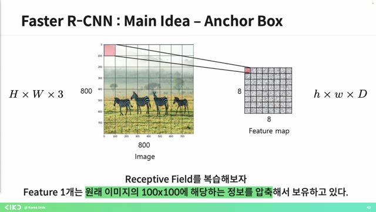
- 피처 맵 대신, 피처 하나마다 한 개의 **바운딩 박스**를 가정하며 이를 처리하게 된다.

- 이 경우 다양한 크기의 바운딩 박스를 만들 수 없으므로, 각 피처마다 다양한 종횡비의 바운딩 박스 아홉 개를 미리 부여한다.

- 격자 하나가 물체 하나를 탐지하도록 하려면, 물체의 크기를 모르기 때문에 바운딩 박스의 크기를 미리 설정하는 것이 중요하다.

- 결과적으로 각 격자 안에 물체의 존재 확률을 도출하게 되고, RPN에서는 분류와 바운딩 박스를 위한 두 개의 피처 맵이 생성된다.

- 각 픽셀에 대해 객체 포함 여부와 아홉 개의 앵커 박스에 대한 판단을 하고, 바운딩 박스 좌표는 네 개로 예측하는 과정으로 진행된다.

### 10. 물체 감지와 바운딩 박스 예측 기법

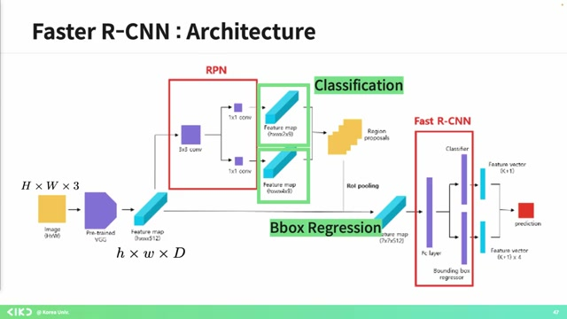
- 각각의 픽셀에 대해 물체 존재 여부와 바운딩 박스를 예측하고자 하며, 여러 앵커 박스를 통해 이 과정을 진행한다.

- 예측된 바운딩 박스 중에서 좋은 것과 나쁜 것을 구분하기 위해 **중복 제거** 과정(NMS)을 실행하여 깔끔한 결과를 얻는다.

- 그 후에는 **리얼타임** 처리의 한계로 인해 속도를 보완하기 위한 욜로 모델을 소개하며, 싱글 스테이지 방식의 훈련 간편성을 강조한다.

- 이 모델은 CNN 구조를 기반으로 하며, 다양한 모듈식 구조보다 간단하고 통합적 학습이 가능하다는 장점을 갖춘다.

### 11. 📊컨볼루션 레이어 설계 및 물체 탐지 과정 설명

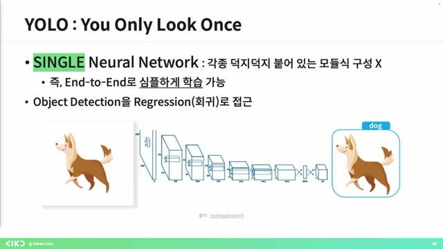
- 컨볼루션 레이어와 네트워크 설계를 살펴보면, 인풋 이미지를 7x7로 분할하여 각 셀이 물체 하나를 탐지하는 역할을 한다.

- 각 그리드 셀은 자신의 책임을 가지고 중심에 있는 오브젝트를 탐지하며, 이를 바운딩 박스와 클래스 스코어로 예측한다.

- 탐지할 수 있는 물체가 여러 개일 경우, 후보군을 여러 개 예측하게 하여, 각 그리드 셀에서 어떤 물체가 있는지에 대한 클래스 스코어를 예측하도록 한다.

- 최종 아웃풋은 인풋 이미지를 나누고, 각 셀이 예측한 정보를 조합하여 생성한다.

### 12. ️🔍YOLO 및 DETR 기반 오브젝트 디텍션 기술 설명

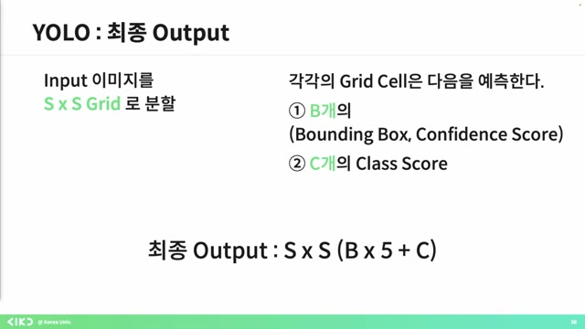
- YOLO는 이미지를 7x7로 분할하여 다양한 크기의 바운딩 박스를 예측하도록 설계되었으며, 최대 20개의 클래스를 예측할 수 있다.

- 이 구조는 CNN을 기반으로 하여 45 프레임의 속도로 **빠른** 처리가 가능하지만, 성능 면에서는 투 스테이지 방식보다 다소 떨어진다.

- 기존의 오브젝트 디텍션 방식은 사람이 설정한 바운딩 박스를 사용하지만, DETR은 이러한 과정을 생략하여 더 간단하게 예측할 수 있다.

- DETR은 리스틱 특성을 제거하여 기존 방법론과 비교해 더 효율적인 오브젝트 디텍션을 가능하게 한다.

### 13. DETR 구조와 트랜스포머의 간단한 이해

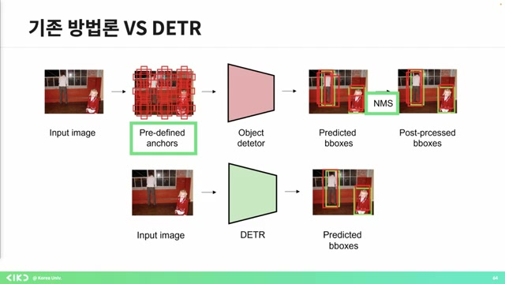
- DETR 구조는 **간단하게** 인풋 이미지가 있으며, 이를 통해 프리딕트 박스가 나온다.

- 이미지가 입력되면 CNN을 통해 피처를 뽑고, 이를 트랜스포머 구조에 넣어 결과를 예측한다.

- 피처를 뽑아 포지셔널 인코딩을 더한 후, 인코더를 통해 다시 피처를 추출하여 오브젝트 쿼리를 통해 클래스와 바운딩 박스를 예측하게 된다.

- 아울러 매칭 과정은 **효율적**이며, CNN과 트랜스포머의 사용으로 인해 계산량이 줄어든다.

- 결론적으로 구조는 단순하나, 구조를 이해하기 위해선 보다 전문적인 설명이 필요하다고 언급했다.

### 14. 트랜스포머의 포지셔널 인코딩 역할

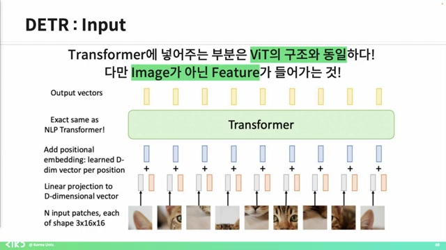
- 트랜스포머 모델에서는 포지셔널 인코딩이 필요하며, 이는 입력 순서가 결과에 영향을 미치지 않도록 하기 위한 것이다.

- 트랜스포머는 입력의 순서가 변했을 때도 동일한 출력을 결과로 내며, 이를 '순열 불변'이라고 한다.

- 따라서 각 패치의 위치 정보를 학습하기 위해 포지셔널 인코딩을 활용하게 되며, 이로 인해 해당 정보를 통해 학습과 추론을 진행할 수 있다.

- 트랜스포머 디코더는 최대 예측 가능한 객체의 개수에 제한이 있으며, 각각의 입력에 대해 바운딩 박스와 클래스 확률을 예측한다.

- 이러한 예측된 바운딩 박스와 클래스 확률은 특정 알고리즘을 통해 매칭되고 로스를 최소화する 역할을 한다.

### 15. 트랜스포머 CNN의 구조와 DTR의 기여

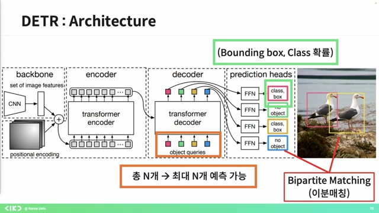
- 트랜스포머 CNN의 구조가 생각보다 간단하다는 것을 확인할 수 있다.

- 많은 오버세이버 모델들이 DT 기반으로 트랜스포머 구조를 사용하고 있으며, 이 모델들은 많이 사용되고 있다.

- 프리디파인 앵커와 NMS 같은 후처리 부분이 완전히 사라졌다는 점도 DTR의 기여 중 하나로 볼 수 있다.

- 질문이 없다면 강의를 마치겠다고 말하며, 수고하셨다는 인사를 전했다.

