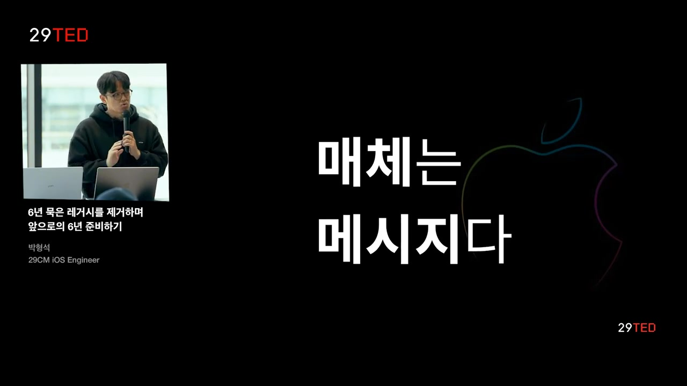

흥미로운 내용 3가지 :

- 레거시 제거 과정에서는 구조적 변경과 코드 리팩토링이 중요하며, 안정성과 확장성을 확보해야 한다.
- 사용자 경험 개선을 위해 UI 및 사용자 인터페이스의 직관성 유지가 필수적이다.
- 레거시의 영향을 줄이기 위한 다이어트 과정은 코드의 히스토리를 파악하고, 불필요한 로직을 제거하는 데 주력해야 한다.

앱 개발의 레거시를 제거하고 향후 유지보수와 안정성을 고려하여 진행한 과정을 소개하는 영상입니다. 레거시 다이어트, 설계 공유, 빠른 롤백 환경 마련을 강조하며, 코드의 안정성과 확장성을 고려한 리팩토링 작업에 대한 전략과 경험을 공유합니다. 또한, 팀 내 역할과 책임을 공유하고 소프트웨어에 대한 지속적인 업그레이드가 중요함을 강조하며, 레거시에 도전하는 것은 현명한 선택일 수 있음을 권장합니다.

# 핵심주제

레거시 코드 제거는 **소프트웨어 관리**의 필수적인 과정이다.

- **박영석** 엔지니어는 레거시를 제거하며 지속 가능한 **소프트웨어 관리**에 대한 필요한 전략을 발표했다.
    
- 레거시 코드가 소프트웨어의 확장성과 안정성에 미치는 영향을 강조하며, 이러한 과정을 통해 **문제 해결** 능력을 강화할 수 있음을 조명했다.
    
- 이러한 제거 작업은 코드 리팩토링과 설계 변경을 통해 이루어지며, 최종적으로 **사용자 경험**을 향상시키는 데 기여한다.
    

사용자 경험 향상을 위한 **디자인 변경**이 필수적이다.

- **디자인** 측면의 문제는 사용자의 혼란을 초래할 수 있으며, 이는 소프트웨어의 완성도를 떨어뜨린다.
    
- 탐색 우선순위를 개선하고, 성공적인 **UI 변경**을 통해 사용자에게 보다 직관적인 경험을 제공해야 한다.
    
- 신속한 **피드백**과 팀 내 공유는 이러한 디자인 변경의 효과를 극대화할 수 있다.
    

레거시 코드 다이어트는 **효율적인 코드 관리**의 시작이다.

- 레거시 다이어트 과정은 불필요한 로직을 제거하고, 코드의 **역사**를 파악하여 해결 방안을 찾는 것이 중요하다.
    
- 문제가 발생하기 전에 코드의 존재 이유와 기능을 면밀히 검토하여, **사이드 이펙트**를 미리 방지할 수 있다.
    
- 이러한 접근은 레거시의 영향을 줄이고, 코드 개선을 통해 보다 나은 **성능**을 이끌어낸다.
    

팀의 **소통과 협력**은 소프트웨어 관리의 핵심이다.

- **문서화**를 통한 팀 간 사항 공유는 프로젝트 진행 상황을 명확히 하고, 효율성을 높이는 데 기여한다.
    
- 작업의 명확한 방향성을 유지함으로써 팀원들과의 **피드백**을 수용하고, 결과물을 개선할 수 있다.
    
- 지속적인 의사소통은 레거시 문제를 해결하는 과정에서도 **효율적인 대응**을 가능하게 한다.
    

멈추지 않는 **리팩토링** 작업이 소프트웨어의 미래를 보장한다.

- 지속적인 리팩토링을 통해 새로운 기능 개발 뿐만 아니라 코드의 전체적인 **품질**을 유지할 수 있다.
    
- 기술의 발전에 따라 변화하는 요구사항에 빠르게 대응할 수 있도록 소프트웨어가 **업그레이드**되어야 한다.
    
- 이러한 변화는 결국 최종 사용자의 만족도를 높이며, 소프트웨어의 경쟁력을 강화하는 데 기여한다.
    

# 타임라인

## 1. 🚀 6년 묵은 레거시 제거 과정의 요약

- **엔지니어 박영석**이 발표를 진행했으며, 날씨가 추운데도 참석해 준 청중에게 감사의 인사를 전함.
    
- 발표 주제는 **"6년 묵은 레거시 제거하며 앞으로의 6년 준비하기"**로, 레거시 제거 과정을 논의.
    
- **원론적인 이야기** 위주로 진행됐고, 구체적인 코드 레벨 이야기는 다루지 않음.
    
- **루트 컨트롤러**라는 큰 레거시를 제거하는 과정과 그 고민을 공유함.
    
- 레거시 제거 작업의 결과를 공유하고, 소프트웨어의 지속 가능한 관리 방법에 대한 생각을 나눔.
    
- **레거시 지옥**을 청중과 함께 경험하고자 하는 의도를 표현함.
    

  

## 2. 🛒카테고리 탭에서 상품 선택 및 필터링하는 사용자 경험 분석

- 수문 그림 찾기 문제에서 사용자가 카테고리 탭에서 베스트나 뉴나 아우터 상품을 선택하고 필터링, 탐색, 정렬 등 다양한 작업을 수행하는 모습을 분석한다.
    
- 첫 번째 장면에서는 PDP를 확인하고 탐색한 뒤, 필터링과 정렬을 진행하는 사용자의 행동을 보여주고, 가격 선택 후 홈으로 돌아가 다시 카테고리 탭으로 이동한다.
    
- 두 번째 장면은 첫 번째와 유사하나, 차이점이 두 개 이상 존재함을 언급하며 사용자 경험을 관찰한다.
    
- 사용자의 행동과 선택지에 따라 레거시 상품의 차이점을 식별하기 위한 분석을 진행한다.
    

  

## 3. 📱디자인 변경으로 사용자 경험과 기능성의 중요성 강조

- 처음 qa 빌드로 제작 후, 영주님과 협업하여 사용자 경험이 크게 달라졌다.
    
- 탐색 중 히스토리가 초기화되는 디자인 문제 발생, 이로 인해 사용자 당황함.
    
- 하단 내비게이션 바 변경으로 UI 싱크성 문제 해결.
    
- 매체는 메시지를 담는 그릇과 같이 중요하며, 서비스 완성도와 UI의 감도도 중요하다.
    

  

## 4. 📱모바일 앱의 사용성과 경험 개선을 위한 리팩토링

- 모바일 앱은 작은 화면의 한계로 불편한 사용성을 가지고 있으며, 사용자에게 몰입감과 심리스한 경험을 제공해야 함.
    
- 레거시를 리팩토링하여 모바일 앱 경험을 개선하는 작업을 진행했으며, 안정성과 확장성에 집중하여 우선순위를 높였다.
    
- 화면 전환 방식의 문제, 푸시의 형태 등을 개선하여 사용자 경험을 향상시키는 중요성을 강조했으며, 루트 컨트롤러가 제거해야 할 주요 요인이었음.
    

  

## 5. 화면 전환과 크래시 이슈에서 루트 컨트롤러 관련 이야기

- 루트 컨트롤러로 인해 새로운 화면 전환과 크래시 문제가 발생했고, 특히 싱글 패턴 구현으로 매모 엑스 문제가 발생하여 앱이 종료되기도 했다.
    
- 이 문제로 인해 스플래시 이미지를 관리하는 중에 앱이 종료되는 상황이 발생했지만 원격으로 문제를 해결할 수 있었고, 결국 루트 컨트롤러 싱글톤 사용을 중지하고 구조적으로 변경했다.
    
- 루트 컨트롤러 제거 작업이 시작됨에 따라 앱 완성도와 확장성, 안정성 측면에서 팩토리 작업이 중요시되었고, 레거시 클래스에서 발생한 문제를 해결하기 위한 전략을 고민했다.
    
- 단순 코드 수정이 아닌 구조 변경을 통해 루트 컨트롤러를 의존성 주입 형태로 사용하여 문제를 해결하고자 노력했다.
    

  

## 6. 💻레거시 다이어트: 코드 안의 불필요한 로직 삭제와 영향 분석.

- 레거시 다이어트는 레거시의 영향력을 명확히 하는 목적을 갖고 불필요한 로직을 제거하는 프로세스.
    
- 하람의 법칙에 따르면, API는 사용자의 선택에 따라 제작자의 의도와는 다르게 발전되는데, 루트 컨트롤러도 여러 사용자들로부터 다양한 로직을 포함하게 되었다.
    
- 레거시 코드 삭제 시 발생하는 사이드 이펙트를 파악하기 어렵고, 새 클래스 생성이나 기능 영향도 고려하는 작업을 수행하여 레거시 영향을 줄이려고 했다.
    

  

## 7. 💻첫 번째 전략: 레거시 다이어트 진행하며 코드의 히스토리 파악하기

- 레거시 다이어트를 통해 **레거시의 영향력을 줄이고 문제 해결 크기를 감소**시켰다.
    
- 코드 리팩토링 시 **코드의 히스토리 파악**이 중요하며, '체스터슨 울타리 원칙'을 적용하여 **용도를 확인하고 결정**해야 한다.
    
- 레거시 코드를 평가할 때는 **존재 이유, 서비스 여부, 미래 사용 가능성**을 고려하여 리포팅해야 한다.
    
- 레거시 다이어트를 통해 **불필요한 코드 제거**로 문제 감소를 이끌어냈으며, 이러한 과정을 통해 당연시되는 이점을 확인하며 전달한다.
    

  

## 8. 💻코드 리팩토링과 설계 공유, 모바일 팀 의사결정 문서 활용

- 루트 컨트롤 내의 수명 연장이 필요한 코드들을 다른 곳으로 이동시켜, 프로젝트 내 역할과 책임 할당 필요.
    
- 이를 위해 설계와 사용 방식 지속적으로 공유하며, 모바일 팀의 의사결정 문서를 활용하여 작업.
    
- 문서에는 프로젝트 설계, 제한 사항, 작업 내역, 논의 및 결론 리스트업을 통해 작업 진행 상황 파악.
    

  

## 9. 📱개발자가 팀 문화와 효율성을 위한 전략 소개

- 첫 번째 전략에서는 **체스터슨 울타리 원칙**을 강조하며, 두 번째 전략에서는 빠른 **작업 공유**가 중요함을 설명함.
    
- 개발자는 개발과정에서 **천재적이고 완벽한** 결과를 바로 보여주고 싶어하는 욕심을 갖지만, 이로 인해 수정 비용과 효율성 문제 발생 가능성을 경고함.
    
- 미리 구로나 문서로 **방향성 공유**하고 **팀원 피드백**을 받으면 작업 **효율**을 증가시키고 **인터페이스 사용**이 **자연스럽게** 이루어짐.
    
- **레거시 대응 과정**에서도 효율을 유지하고, **빠른 롤백** 환경 마련이 중요하며, 모바일 앱 개발 시 **버전 롤백의 어려움**을 강조하고 **사용자 반응**에 대비해야 함.
    

  

## 10. 💻코드 개발 중 기능 롤백을 가능케 하는 전략

- 불가능한 버전 롤백은 아쉽지만, 실험 중에는 **기능 롤백이 가능**했다.
    
- 앰플리튜드 플래그를 사용하여 배포 없이 **즉시 기능 롤백**이 가능하며, **안정적인 개발**을 위한 전략으로 이용되었다.
    
- 무사하게 리팩토링을 완료하기 위해 **세 가지 전략**을 적용하여 코드를 작성하였다.
    
- 기능 분기를 염두에 두고 항상 코드를 작성했으며, 기능에 문제 발생 시 **이전 기능**을 사용할 수 있도록 대비하였다.
    

  

## 11. 💻리팩토링과 소프트웨어 업그레이드의 중요성, 코드 관리 전략

- 리팩토링 작업은 새로운 피처를 개발하는 것보다 지루하고 반복적이며 **무력감**을 느낄 때도 많았다.
    
- 소프트웨어 업그레이드는 중요하며, 속도만 올리다 보면 **기술 부족 문제**에 직면할 수 있다는 인사이트를 얻었다.
    
- 소프트웨어 관리시 100만 줄과 10만 줄의 코드 차이는 배의 차이이며, **시간과 규모를 고려하여 코드 작성**이 필요하다는 깨달음을 얻었다.
    
- 팀 내 인터페이스 설계 논의를 통해 나아가며, 소중한 코드 한 줄 작성에 집중하고, **레거시 리토**를 도전해 보기를 권유한다.
    
- 만화 결론에서는 **자신이 어리석다는 것을 인정하는 것**이 중요하다는 메시지를 셰익스피어 인용으로 전달하였다.
    

  

## 12. 💻 레거시에 도전하고 안정적인 소프트웨어의 미래를 고민하는 엔지니어들을 격려함.

- 안정적인 소프트웨어의 미래가 있다면 레거시에 도전하는 것을 권장하며, **확장성**이 중요하다고 이야기하고 있다.
    
- 플랫폼의 무덤 영역에 대한 흥미로운 도전을 권유하며, **엔지니어**와 **테크 리더**와 소통하며 협력하는 중요성을 강조한다.
    
- 엔지니어들에게 레거시의 지옥에서 **배울 점이 있음을 감사하면서** 세션을 마무리한다.